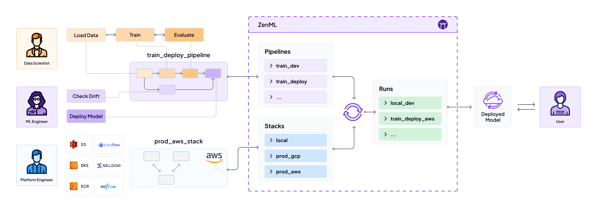
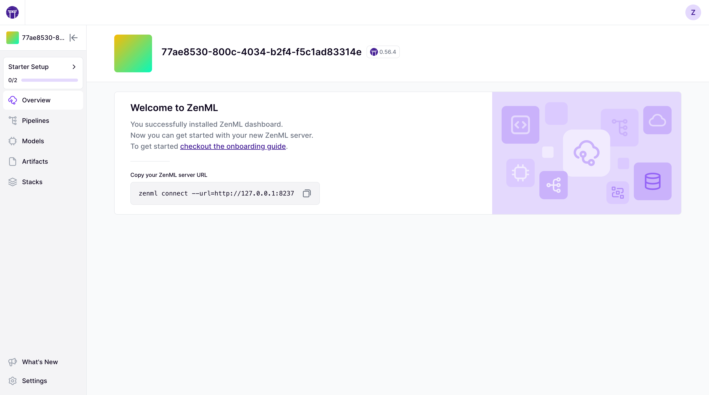

<!-- PROJECT SHIELDS -->
<!--
*** I'm using markdown "reference style" links for readability.
*** Reference links are enclosed in brackets [ ] instead of parentheses ( ).
*** See the bottom of this document for the declaration of the reference variables
*** for contributors-url, forks-url, etc. This is an optional, concise syntax you may use.
*** https://www.markdownguide.org/basic-syntax/#reference-style-links
-->

[![PyPi][pypi-shield]][pypi-url]
[![PyPi][pypiversion-shield]][pypi-url]
[![PyPi][downloads-shield]][downloads-url]
[![Contributors][contributors-shield]][contributors-url]
[![License][license-shield]][license-url]
<!-- [![Build][build-shield]][build-url] -->
<!-- [![CodeCov][codecov-shield]][codecov-url] -->

<!-- MARKDOWN LINKS & IMAGES -->
<!-- https://www.markdownguide.org/basic-syntax/#reference-style-links -->

[pypi-shield]: https://img.shields.io/pypi/pyversions/zenml?style=for-the-badge

[pypi-url]: https://pypi.org/project/zenml/

[pypiversion-shield]: https://img.shields.io/pypi/v/zenml?style=for-the-badge

[downloads-shield]: https://img.shields.io/pypi/dm/zenml?style=for-the-badge

[downloads-url]: https://pypi.org/project/zenml/

[codecov-shield]: https://img.shields.io/codecov/c/gh/zenml-io/zenml?style=for-the-badge

[codecov-url]: https://codecov.io/gh/zenml-io/zenml

[contributors-shield]: https://img.shields.io/github/contributors/zenml-io/zenml?style=for-the-badge

[contributors-url]: https://github.com/othneildrew/Best-README-Template/graphs/contributors

[license-shield]: https://img.shields.io/github/license/zenml-io/zenml?style=for-the-badge

[license-url]: https://github.com/zenml-io/zenml/blob/main/LICENSE

[linkedin-shield]: https://img.shields.io/badge/-LinkedIn-black.svg?style=for-the-badge&logo=linkedin&colorB=555

[linkedin-url]: https://www.linkedin.com/company/zenml/

[twitter-shield]: https://img.shields.io/twitter/follow/zenml_io?style=for-the-badge

[twitter-url]: https://twitter.com/zenml_io

[slack-shield]: https://img.shields.io/badge/-Slack-black.svg?style=for-the-badge&logo=linkedin&colorB=555

[slack-url]: https://zenml.io/slack-invite

[build-shield]: https://img.shields.io/github/workflow/status/zenml-io/zenml/Build,%20Lint,%20Unit%20&%20Integration%20Test/develop?logo=github&style=for-the-badge

[build-url]: https://github.com/zenml-io/zenml/actions/workflows/ci.yml


<!-- PROJECT LOGO -->
<br />
<div align="center">
  <a href="https://zenml.io">
    
  </a>

<h3 align="center">Build portable, production-ready MLOps pipelines.</h3>

  <p align="center">
    A simple yet powerful open-source framework that integrates all your ML tools.
    <br />
    <a href="https://docs.zenml.io/"><strong>Explore the docs »</strong></a>
    <br />
    <div align="center">
      Join our <a href="https://zenml.io/slack-invite" target="_blank">
      
    <b>Slack Community</b> </a> and be part of the ZenML family.
    </div>
    <br />
    <a href="https://zenml.io/features">Features</a>
    ·
    <a href="https://zenml.io/roadmap">Roadmap</a>
    ·
    <a href="https://github.com/zenml-io/zenml/issues">Report Bug</a>
    ·
    <a href="https://zenml.io/discussion">Vote New Features</a>
    ·
    <a href="https://blog.zenml.io/">Read Blog</a>
    ·
    <a href="#-meet-the-team">Meet the Team</a>
    <br />
    🎉 Version 0.39.1 is out. Check out the release notes
    <a href="https://github.com/zenml-io/zenml/releases">here</a>.
    <br />
    <br />
    <a href="https://www.linkedin.com/company/zenml/">
    
    </a>
    <a href="https://twitter.com/zenml_io">
    
    </a>
    <a href="https://www.youtube.com/c/ZenML">
    
    </a>
  </p>
</div>

<!-- TABLE OF CONTENTS -->
<details>
  <summary>🏁 Table of Contents</summary>
  <ol>
    <li><a href="#-introduction">Introduction</a></li>
    <li><a href="#-quickstart">Quickstart</a></li>
    <li>
      <a href="#-create-your-own-mlops-platform">Create your own MLOps Platform</a>
      <ul>
        <li><a href="#-deploy-zenML">Deploy ZenML</a></li>
        <li><a href="#-deploy-stack-components">Deploy Stack Components</a></li>
        <li><a href="#-create-a-pipeline">Create a Pipeline</a></li>
        <li><a href="#-start-the-dashboard">Start the Dashboard</a></li>
      </ul>
    </li>
    <li><a href="#-roadmap">Roadmap</a></li>
    <li><a href="#-contributing-and-community">Contributing and Community</a></li>
    <li><a href="#-getting-help">Getting Help</a></li>
    <li><a href="#-license">License</a></li>
  </ol>
</details>

<br />

# 🤖 Introduction

🤹 ZenML is an extensible, open-source MLOps framework for creating portable,
production-ready machine learning pipelines. By decoupling infrastructure from
code, ZenML enables developers across your organization to collaborate more
effectively as they develop to production.

- 💼 ZenML gives data scientists the freedom to fully focus on modeling and
experimentation while writing code that is production-ready from the get-go.

- 👨‍💻 ZenML empowers ML engineers to take ownership of the entire ML lifecycle
  end-to-end. Adopting ZenML means fewer handover points and more visibility on
  what is happening in your organization.

- 🛫 ZenML enables MLOps infrastructure experts to define, deploy, and manage
sophisticated production environments that are easy to use for colleagues.



ZenML provides a user-friendly syntax designed for ML workflows, compatible with
any cloud or tool. It enables centralized pipeline management, enabling
developers to write code once and effortlessly deploy it to various
infrastructures.

<div align="center">
    
</div>

# 🤸 Quickstart

[Install ZenML](https://docs.zenml.io/getting-started/installation) via
[PyPI](https://pypi.org/project/zenml/). Python 3.7 - 3.10 is required:

```bash
pip install "zenml[server]"
```

Take a tour with the guided quickstart by running:

```bash
zenml go
```

# 🖼️ Create your own MLOps Platform

ZenML allows you to create and manage your own MLOps platform using 
best-in-class open-source and cloud-based technologies. Here is an example of 
how you could set this up for your team:

## 🔋 1. Deploy ZenML

For full functionality ZenML should be deployed on the cloud to
enable collaborative features as the central MLOps interface for teams.


In case you're machine is authenticated with one of the big three cloud 
providers, this command will do the full deployment for you.

```bash
zenml deploy --provider aws  # aws, gcp and azure are supported providers
```

You can also choose to deploy with docker or helm with full control over
the configuration and deployment. Check out the
[docs](https://docs.zenml.io/getting-started/deploying-zenml/deploying-zenml)
to find out how.

## 👨‍🍳 2. Deploy Stack Components

ZenML boasts a ton of [integrations](https://zenml.io/integrations) into 
popular MLOps tools. The [ZenML Stack](https://docs.zenml.io/starter-guide/stacks/stacks) 
concept ensures that these tools work nicely together, therefore bringing
structure and standardization into the MLOps workflow.

Deploying and configuring this is super easy with ZenML. For **AWS**, this might 
look a bit like this

```bash
#Deploy and register an orchestrator and an artifact store
zenml orchestrator deploy my_first_kubeflow --flavor kubeflow --cloud aws ...
zenml artifact-store deploy my_first_artifact_store --flavor s3 --cloud aws ...

# Register this combination of components as a stack
zenml stack register production_stack --orchestrator my_first_kubeflow --artifact-store my_first_artifact_store --set # Register your production environment
```

When you run a pipeline with this stack set, it will be running on your deployed
kubeflow instance.

You can also [deploy your own tooling manually]()
or [register existing tooling]().

## 🏇 3. Create a Pipeline

Here's an example of a hello world ZenML pipeline in code:

```python
# run.py
from zenml import pipeline, step


@step
def step_1() -> str:
    """Returns the `world` substring."""
    return "world"


@step
def step_2(input_one: str, input_two: str) -> None:
    """Combines the two strings at its input and prints them."""
    combined_str = input_one + ' ' + input_two
    print(combined_str)


@pipeline
def my_pipeline():
    output_step_one = step_1()
    step_2(input_one="hello", input_two=output_step_one)


if __name__ == "__main__":
    my_pipeline()
```

```bash
python run.py
```

## 👭 4. Start the Dashboard

Open up the ZenML dashboard using this command.

```bash
zenml show
```



# 🗺 Roadmap

ZenML is being built in public. The [roadmap](https://zenml.io/roadmap) is a
regularly updated source of truth for the ZenML community to understand where
the product is going in the short, medium, and long term.

ZenML is managed by a [core team](https://zenml.io/company#CompanyTeam) of
developers that are responsible for making key decisions and incorporating
feedback from the community. The team oversees feedback via various channels,
and you can directly influence the roadmap as follows:

- Vote on your most wanted feature on our [Discussion
  board](https://zenml.io/discussion).
- Start a thread in our [Slack channel](https://zenml.io/slack-invite).
- [Create an issue](https://github.com/zenml-io/zenml/issues/new/choose) on our
  Github repo.

# 🙌 Contributing and Community

We would love to develop ZenML together with our community! Best way to get
started is to select any issue from the [`good-first-issue`
label](https://github.com/zenml-io/zenml/labels/good%20first%20issue). If you
would like to contribute, please review our [Contributing
Guide](CONTRIBUTING.md) for all relevant details.

# 🆘 Getting Help

The first point of call should
be [our Slack group](https://zenml.io/slack-invite/).
Ask your questions about bugs or specific use cases, and someone from
the [core team](https://zenml.io/company#CompanyTeam) will respond.
Or, if you
prefer, [open an issue](https://github.com/zenml-io/zenml/issues/new/choose) on
our GitHub repo.

# 📜 License

ZenML is distributed under the terms of the Apache License Version 2.0.
A complete version of the license is available in the [LICENSE](LICENSE) file in
this repository. Any contribution made to this project will be licensed under
the Apache License Version 2.0.
