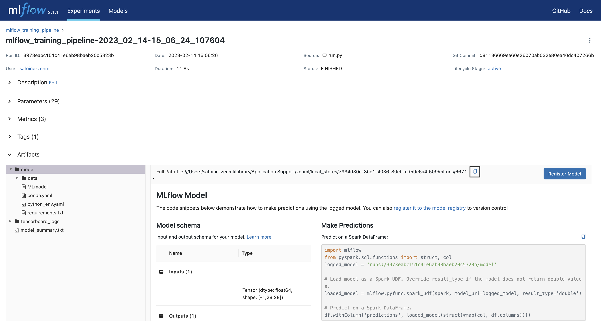

The MLflow Model Registry is a [model registry](./model-registries.md) flavor
provided with the MLflow ZenML integration that uses
[the MLflow model registry service](https://mlflow.org/docs/latest/model-registry.html)
to manage and track ML models and their artifacts.

## When would you want to use it?

[MLflow Model Registry](https://mlflow.org/docs/latest/model-registry.html)) is
a powerful tool that you would typically use in the experimenting, QA and
production phase to manage and track machine learning model versions. It is
designed to help teams collaborate on model development and deployment, and keep
track of which models are being used in which environments. With MLflow Model
Registry, you can store and manage models, deploy them to different environments,
and track their performance over time. This tool is useful in the following
scenarios:

* If you are working on a machine learning project and want to keep track of
different model versions as they are developed and deployed.
* If you need to deploy machine learning models to different environments and
want to keep track of which version is being used in each environment.
* If you want to monitor and compare the performance of different model versions
over time, and make data-driven decisions about which models to use in production.
* If you want to simplify the process of deploying models either to a production
environment or to a staging environment for testing.

## How do you deploy it?

The MLflow Experiment Tracker flavor is provided by the MLflow ZenML
integration, so you need to install it on your local machine to be able to register
an MLflow Model Registry component. Note that the MLFlow model registry requires
[MLFlow Experiment Tracker](../experiment-trackers/mlflow.md) to be present in
the stack.

```shell
zenml integration install mlflow -y
```

Once the MLflow integration is installed, you can register an MLflow Model
Registry component in your stack:

```shell
zenml model-registry register mlflow_model_registry --flavor=mlflow

# Register and set a stack with the new model registry as the active stack
zenml stack register custom_stack -r mlflow_model_registry ... --set
```


The MLFlow Model Registry will automatically use the same configuration as the
MLFlow Experiment Tracker. So if you have a remote MLFlow tracking server
configured in your stack, the MLFlow Model Registry will also use the same
configuration.


## How do you use it?

There are different ways to use the MLflow Model Registry. You can use it in
your ZenML pipelines with the built-in step, or you can use the ZenML CLI to
register your model manually or call the Model Registry API within a custom
step in your pipeline. The following sections show you how to use the MLflow
Model Registry in your ZenML pipelines and with the ZenML CLI:

### Built-in MLflow Model Registry step

After registering the MLflow Model Registry component in your stack, you can
use it in a pipeline by using the `mlflow_model_registry_step` which is a
built-in step that is provided by the MLflow ZenML integration. This step
automatically registers the model that was produced by the previous step in the
pipeline.

```python
mlflow_training_pipeline(
    importer=loader_mnist(),
    normalizer=normalizer(),
    trainer=tf_trainer(params=TrainerParameters(epochs=5, lr=0.003)),
    evaluator=tf_evaluator(),
    model_register=mlflow_register_model_step(
        params=MLFlowRegistryParameters(
            name="tensorflow-mnist-model",
            metadata=ModelRegistryModelMetadata(
                lr=lr, epochs=5, optimizer="Adam"
            ),
            description=f"Run #{i+1} of the mlflow_training_pipeline.",
        )
    ),
).run()
```

### Model Registry CLI Commands

Sometimes adding a step to your pipeline is not the best option for you, as it
will register the model in the MLflow Model Registry every time you run the
pipeline. In this case, you can use the ZenML CLI to register your model
manually. The CLI provides a command called `zenml model-registry models register-version`
that you can use to register your model in the MLflow Model Registry.

```shell
zenml model-registry models register-version Tensorflow-model \
    --description="A new version of the tensorflow model with accuracy 98.88%" \
    -v 1 \
    --model-uri="file:///.../mlruns/667102566783201219/3973eabc151c41e6ab98baeb20c5323b/artifacts/model" \
    -m key1 value1 -m key2 value2 \
    --zenml-pipeline-name="mlflow_training_pipeline" \
    --zenml-step-name="trainer"
```

### List of available parameters

To register a model version in the MLflow Model Registry, you need to provide
list of parameters. when you use the built-in step, most of the parameters are
automatically filled in for you. However, you can still override them if you
want to. The following table shows the list of available parameters.

* `name`: The name of the model. This is a required parameter.
* `model_source_uri`: The path to the model. This is a required parameter.
* `description`: A description of the model version.
* `metadata`: A list of metadata to associate with the model version of type
`ModelRegistryModelMetadata`. 



The `model_uri` parameter is the path to the model within the MLflow tracking
server. If you are using a local MLflow tracking server, the path will be
something like `file:///.../mlruns/667102566783201219/3973eabc151c41e6ab98baeb20c5323b/artifacts/model`.
If you are using a remote MLflow tracking server, the path will be something
like `s3://.../mlruns/667102566783201219/3973eabc151c41e6ab98baeb20c5323b/artifacts/model`.

You can find the path of the model in the MLflow UI. Go to the `Artifacts` tab
of the run that produced the model and click on the model. The path will be
displayed in the URL.




Check out the
[API docs](https://apidocs.zenml.io/latest/integration_code_docs/integrations-mlflow/#zenml.integrations.mlflow.model_registry.MLFlowModelRegistry) 
to see more about the interface and implementation.
You can also [check out our examples page](https://github.com/zenml-io/zenml/tree/main/examples/mlflow_registry) for a working example that uses the
MLflow Model Registry.
