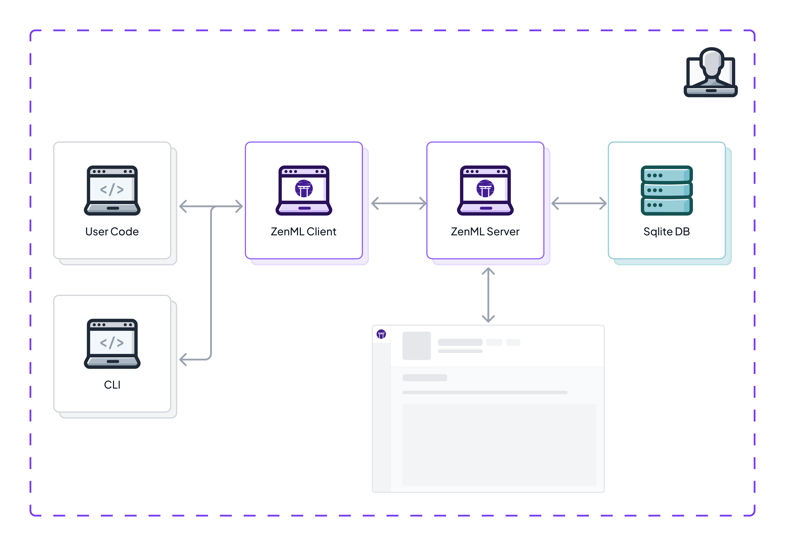

# 🤔 Deploying ZenML

Transitioning your machine learning pipelines to production means deploying your models on real-world data to make predictions that drive business decisions. To achieve this, you need an infrastructure that can handle the demands of running machine learning models at scale. However, setting up such an infrastructure involves careful planning and consideration of various factors, such as data storage, compute resources, monitoring, and security.

Moving to a production environment offers several benefits over staying local:

1. **Scalability**: Production environments are designed to handle large-scale workloads, allowing your models to process more data and deliver faster results.
2. **Reliability**: Production-grade infrastructure ensures high availability and fault tolerance, minimizing downtime and ensuring consistent performance.
3. **Collaboration**: A shared production environment enables seamless collaboration between team members, making it easier to iterate on models and share insights.

Despite these advantages, transitioning to production can be challenging due to the complexities involved in setting up the needed infrastructure.

This is where the **ZenML server** comes in. By providing seamless integration with various [MLOps tools](https://zenml.io/integrations) and platforms, ZenML simplifies the process of moving your pipelines into production.

### ZenML Server

When you first get started with ZenML, it is based on the following architecture on your machine.

The SQLite database that you can see in this diagram is used to store information about pipelines, pipeline runs, stacks, and other configurations. In the previous pages, we used the `zenml up` command to spin up a local REST server to serve the dashboard as well. The diagram for this will look as follows:


In Scenario 2, the `zenml up` command implicitly connects the client to the server.


In order to move into production, you will need to deploy this server somewhere centrally so that the different cloud stack components can read from and write to the server. Additionally, this also allows all your team members to connect to it and share stacks and pipelines.

### Deploying a ZenML Server

Deploying the ZenML Server is a crucial step towards transitioning to a production-grade environment for your machine learning projects. By setting up a deployed ZenML Server instance, you gain access to powerful features, allowing you to use stacks with remote components, centrally track progress, collaborate effectively, and achieve reproducible results.

Currently, there are two main options to access a deployed ZenML server:

1. **ZenML Cloud:** With [ZenML Cloud](zenml-cloud/), you can utilize a control plane to create ZenML servers, also known as tenants. These tenants are managed and maintained by ZenML's dedicated team, alleviating the burden of server management from your end. Importantly, your data remains securely within your stack, and ZenML's role is primarily to handle tracking and server maintenance.
2. **Self-hosted Deployment:** Alternatively, you have the flexibility to deploy ZenML on your own self-hosted environment. This can be achieved through various methods, including using [our CLI](zenml-self-hosted/deploy-with-zenml-cli.md), [Docker](../component-guide/model-registries/), [Helm](zenml-self-hosted/deploy-with-helm.md), or [HuggingFace Spaces](zenml-self-hosted/deploy-using-huggingface-spaces.md).

Both options offer distinct advantages, allowing you to choose the deployment approach that best aligns with your organization's needs and infrastructure preferences. Whichever path you select, ZenML facilitates a seamless and efficient way to take advantage of the ZenML Server and enhance your machine learning workflows for production-level success.

<figure><figcaption></figcaption></figure>
