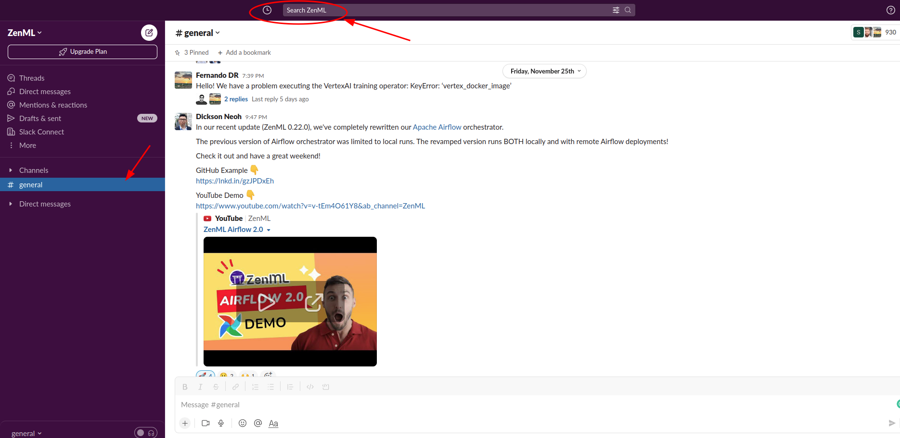
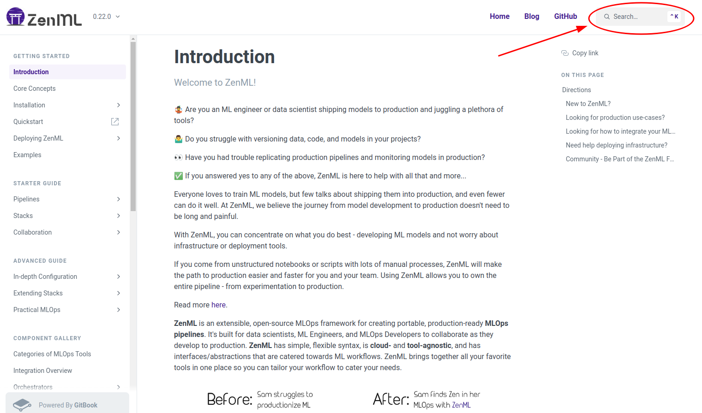
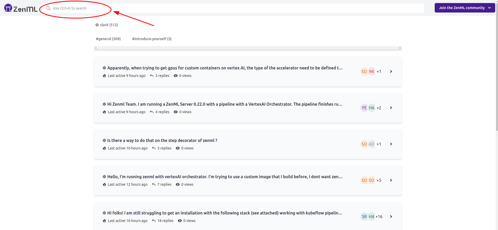

# Debugging Guide
This page documents a series of how-tos for efficient debugging and getting help.

## 💡 Introduction
If you stumbled upon this page, chances are you're facing issues with using ZenML.
This page documents suggestions and best practices to let you debug, get help, and solve issues quickly.

## 🔷 When to get help?
We suggest going through the following before asking for help: 

* Search on Slack using the built-in Slack search function at the top of the page. 

* Search on [GitHub issues](https://github.com/zenml-io/zenml/issues).
* Search the [docs](https://docs.zenml.io) using the search bar in the top right corner of the page.

* Search on https://open.crowd.dev/zenml for issues older than 90 days on our Slack channel.

* Check out the [Common errors](#-common-errors) section below.

Chances are you'd find your answers there.
If you can't find any clue, then it's time to post your question on Slack.
Join our Slack channel [here](https://zenml.io/slack).

## 🎯 How to post on Slack?
When posting on Slack it's useful to provide the following information (when applicable) so that we get a 
complete picture before jumping into solutions.

### 1️⃣ System Information
Let us know relevant information about your system.
We recommend running the following in your terminal and attaching the output to your question.

`python -c "import zenml.environment; print(zenml.environment.get_system_details())"`

The output should look something like this:

```python
ZenML version: 0.21.0
Install path: /home/dnth/anaconda3/envs/zenmlexample/lib/python3.8/site-packages/zenml
Python version: 3.8.13
Platform information: {'os': 'linux', 'linux_distro': 'ubuntu', 'linux_distro_like': 'debian', 'linux_distro_version': '20.04'}
Environment: native
Integrations: ['airflow', 'graphviz']
```

System information provides more context to your issue and also eliminates the need for anyone to ask when they're trying to help.  
This increases the chances of your question getting answered and saves time for everyone.

### 2️⃣ What happened?
Tell us briefly:
* What were you trying to achieve? 
* What did you expect to happen?
* What actually happened?

### 3️⃣ How to reproduce the error?
Walk us through how to reproduce the same error you had step-by-step, whenever possible.
Use the format you prefer. 
Write it in text or record a video, whichever lets you get the issue at hand across to us!

### 4️⃣ Relevant log output
As a general rule of thumb, always attach relevant log outputs and the full error traceback to help us understand what happened under the hood.
If the full error traceback does not fit into a text message, attach a file or use a service like [Pastebin](https://pastebin.com/).

Along with the error traceback, we recommend to always share the output of the following commands: 
* `zenml status` 
* `zenml stack describe`

When applicable, also attach logs of the orchestrator. For example, if you're using the Kubeflow orchestrator, include the logs of the pod that was running the step that failed.

Usually, the default log you see in your terminal is sufficient, in the event it's not, then it's useful to provide additional logs.
Additional logs are not shown by default, you'll have to toggle an environment variable for it.
Read the next section to find out how.


## 🔄 Additional logs
When the default logs are not helpful, ambiguous, or does not point you to the root of the issue, you can toggle the value of the `ZENML_LOGGING_VERBOSITY` environment variable to change the type of logs shown.
The default value of `ZENML_LOGGING_VERBOSITY` environment variable is:

```shell
ZENML_LOGGING_VERBOSITY=INFO
```

You can pick other values such as `WARN`, `ERROR`, `CRITICAL`, `DEBUG` to change what's shown in the logs.
And export the environment variable in your Linux/macOS terminal. 
For example:
```
export ZENML_LOGGING_VERBOSITY=DEBUG
```

Read more about how to set environment variables [here](https://linuxize.com/post/how-to-set-and-list-environment-variables-in-linux/).
See [System Environment Variable](../guidelines/system-environmental-variables.md) for more information on other environment variables that affect the behavior of ZenML.

## 📜 View client and server logs
When facing a ZenML Server-related issue you can view the logs of the server to introspect deeper.

To see the logs of the local ZenML Server deployment run:

```shell
zenml logs
```

To see the logs for ZenML Server deployed using Docker containers, first you have to get ID of the Docker container:

```shell
docker ps
```

and view the logs from the container:
```shell
docker logs <ID>
```

To see logs for ZenML Server deployed on Kubernetes using Helm chart or `zenml deploy`, first get the pod name:
```shell
kubectl get pods -n <NAMESPACE_IN_WHICH_SERVER_IS_DEPLOYED>
```

and the view the logs:
```shell
kubectl logs <CONTAINER_NAME> -n <NAMESPACE> -c <CONTAINER_NAME>
```

For example

```shell
$ kubectl -n zenml-server-hamza get pods
NAME                            READY   STATUS    RESTARTS   AGE
zenml-server-549b46d659-5n28m   1/1     Running   0          99m
$ kubectl -n zenml-server-hamza logs zenml-server-549b46d659-5n28m
```

The logs from a healthy server should look something like this
```shell
INFO:asyncio:Syncing pipeline runs...
2022-10-19 09:09:18,195 - zenml.zen_stores.metadata_store - DEBUG - Fetched 4 steps for pipeline run '13'. (metadata_store.py:315)
2022-10-19 09:09:18,359 - zenml.zen_stores.metadata_store - DEBUG - Fetched 0 inputs and 4 outputs for step 'importer'. (metadata_store.py:427)
2022-10-19 09:09:18,461 - zenml.zen_stores.metadata_store - DEBUG - Fetched 0 inputs and 4 outputs for step 'importer'. (metadata_store.py:427)
2022-10-19 09:09:18,516 - zenml.zen_stores.metadata_store - DEBUG - Fetched 2 inputs and 2 outputs for step 'normalizer'. (metadata_store.py:427)
2022-10-19 09:09:18,606 - zenml.zen_stores.metadata_store - DEBUG - Fetched 0 inputs and 4 outputs for step 'importer'. (metadata_store.py:427)
```

## ❌ Common errors
This section documents frequently encountered errors among users and solutions to each.

### 💢 Error initializing rest store

Typically, the error presents itself as: 

```bash
RuntimeError: Error initializing rest store with URL 'http://127.0.0.1:8237': HTTPConnectionPool(host='127.0.0.1', port=8237): Max retries exceeded with url: /api/v1/login (Caused by 
NewConnectionError('<urllib3.connection.HTTPConnection object at 0x7f9abb198550>: Failed to establish a new connection: [Errno 61] Connection refused'))
```

If you restarted your machine after deploying ZenML then you have to run `zenml up` again after each restart.
Local ZenML deployments don't survive machine restarts.


### 💢 Column 'step_configuration' cannot be null

```bash
sqlalchemy.exc.IntegrityError: (pymysql.err.IntegrityError) (1048, "Column 'step_configuration' cannot be null")
```

This happens when a step configuration is too long. 
We changed the limit from 4K to 65K chars, but it could still happen if you have excessively long strings in your config.


### 💢 'Nonetype' object has no attribute 'name'
This is also a common error you might encounter when you do not have the necessary stack components registered on the stack.

For example:

```shell
╭─────────────────────────────── Traceback (most recent call last) ────────────────────────────────╮
│ /home/dnth/Documents/zenfiles/nba-pipeline/run_pipeline.py:24 in <module>                        │
│                                                                                                  │
│    21 │   reference_data_splitter,                                                               │
│    22 │   TrainingSplitConfig,                                                                   │
│    23 )                                                                                          │
│ ❱  24 from steps.trainer import random_forest_trainer                                            │
│    25 from steps.encoder import encode_columns_and_clean                                         │
│    26 from steps.importer import (                                                               │
│    27 │   import_season_schedule,                                                                │
│                                                                                                  │
│ /home/dnth/Documents/zenfiles/nba-pipeline/steps/trainer.py:24 in <module>                       │
│                                                                                                  │
│   21 │   max_depth: int = 10000                                                                  │
│   22 │   target_col: str = "FG3M"                                                                │
│   23                                                                                             │
│ ❱ 24 @step(enable_cache=False, experiment_tracker=experiment_tracker.name)                       │
│   25 def random_forest_trainer(                                                                  │
│   26 │   train_df_x: pd.DataFrame,                                                               │
│   27 │   train_df_y: pd.DataFrame,                                                               │
╰──────────────────────────────────────────────────────────────────────────────────────────────────╯
AttributeError: 'NoneType' object has no attribute 'name'
```

In the above error snippet, the `step` on line 24 expects an experiment tracker but could not find it on the stack.
To solve it, register an experiment tracker of your choice on the stack. For example

```shell
zenml experiment-tracker register mlflow_tracker  --flavor=mlflow
```

and update your stack with the experiment tracker:
```shell
zenml stack update -e mlflow_tracker
```

This also applies to all other [stack components](https://docs.zenml.io/component-gallery/categories).
Read more about registering stacks [here](https://docs.zenml.io/starter-guide/stacks/registering-stacks).


### 💢 Install ZenML on Apple Silicon without Rosetta
Our recommended, and tested approach is to install via `Rosetta`.

But a community member recently discovered a way to install ZenML on Apple Silicon without Rosetta.
Join the conversation [here](https://open.crowd.dev/zenml/for-what-its-worth-i-was-able-to-successfully-install?q=&p=1).