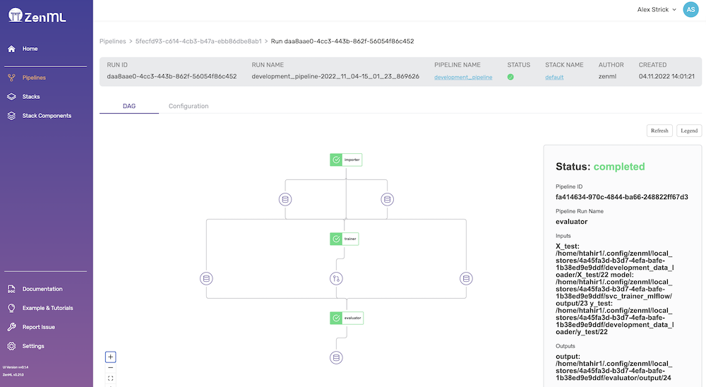

# Dashboard 101

ZenML comes with a native dashboard that allows you to monitor your pipelines
and their runs. It is a great way to get a quick overview of your pipelines and
their runs, and to inspect the artifacts that were produced by your pipeline
runs.

## How to use it

The ZenML dashboard is served via the ZenML server. You must be connected to a
local or deployed server in order to use the dashboard.

The new ZenML Dashboard is now bundled into the ZenML Python package and can be
launched directly from Python. The source code lives in the
[ZenML Dashboard repository](https://github.com/zenml-io/zenml-dashboard).

### Local dashboard

To launch it locally, simply run `zenml up` on your machine and follow the
instructions:

```bash
$ zenml up
Deploying a local ZenML server with name 'local'.
Connecting ZenML to the 'local' local ZenML server (http://127.0.0.1:8237).
Updated the global store configuration.
Connected ZenML to the 'local' local ZenML server (http://127.0.0.1:8237).
The local ZenML dashboard is available at 'http://127.0.0.1:8237'. You can
connect to it using the 'default' username and an empty password.
```

The Dashboard will be available at `http://localhost:8237` by
default:


To start the dashboard locally, run the following command:

```shell
zenml up
```


### Deployed dashboard

For more details on other possible deployment options, see the
[ZenML deployment documentation](../../getting-started/deploying-zenml/deploying-zenml.md).

To connect to a deployed instance of the ZenML server use the `zenml connect`
CLI command. To connect to a ZenML server, you can either pass the configuration
as command line arguments or as a YAML file:

```shell
zenml connect --url=https://zenml.example.com:8080 --username=admin --no-verify-ssl
```

or

```shell
zenml connect --config=/path/to/zenml_server_config.yaml
```

For full details, please refer to [the server deployment documentation](../../getting-started/deploying-zenml/deploying-zenml.md).

## What can you do with it

The dashboard serves as a visual interface to see pipelines, pipeline runs,
stacks and stack components. It also gives you a way to inspect the artifacts
produced through the pipeline runs.


