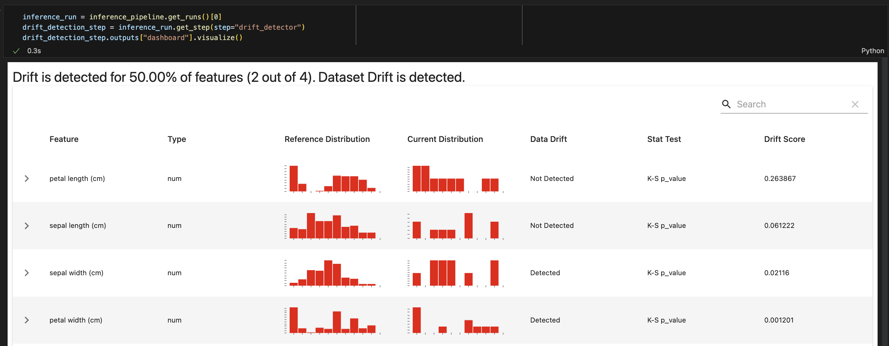
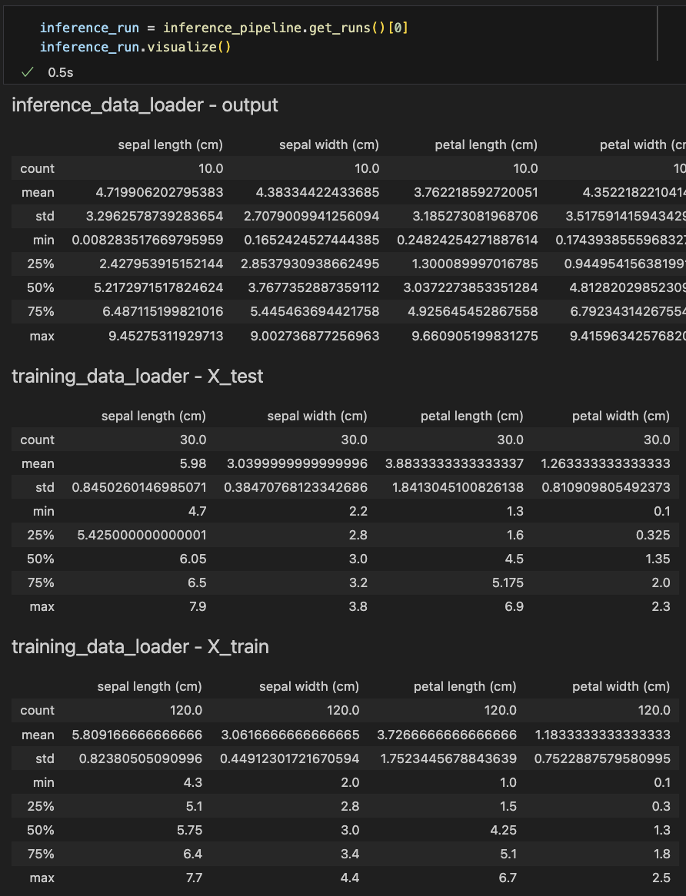

# Inspecting Pipeline Runs

Once a pipeline run has completed, we can access it using the post-execution
utilities.

Each pipeline can have multiple runs associated with it, and for each run there
might be several outputs for each step. Thus, to inspect a specific output, we
first need to access the respective pipeline, then fetch the respective run, 
and then choose the step output of that specific run.

The overall hierarchy looks like this:

```shell
pipelines -> runs -> steps -> outputs

# where -> implies a 1-many relationship.
```

Let us investigate how to traverse this hierarchy level by level:

## Pipelines

ZenML keeps a collection of all created pipelines with at least one
run sorted by the time of their first run from from newest to oldest.

You can either access this collection via the `get_pipelines()` method or query
a specific pipeline by name using `get_pipeline(pipeline=...)`:

```python
from zenml.post_execution import get_pipelines, get_pipeline

# get all pipelines from all stacks
pipelines = get_pipelines()

# now you can get pipelines by index; pipelines are sorted in descending order
# of their first run time (most recent first)
pipeline_with_latest_initial_run_time = pipelines[0]

# or get one pipeline by name
pipeline_x = get_pipeline(pipeline="example_pipeline")

# or even use the pipeline class
pipeline_x = get_pipeline(pipeline=example_pipeline)
```


Be careful when accessing pipelines by index. Even if you just ran a pipeline 
it might not be at index `-1`, due to the fact that the pipelines are sorted 
by time of *first* run. Instead, it is recommended to access the pipeline using 
the pipeline class, an instance of the class or even the name of the 
pipeline as a string: `get_pipeline(pipeline=...)`.


<details>
<summary>Using the CLI</summary>

You can also access your pipelines through the CLI by executing the following command on the terminal:

```shell
zenml pipeline list
```

ZenML allows you to filter and/or sort the output of this command using a variety of flags.
For example, you could sort the pipelines list in a reverse alphabetical order
by passing in:

```shell
zenml pipeline list --sort_by "asc:name"
```

Please [refer to our
documentation](https://apidocs.zenml.io/latest/cli/#zenml.cli--filtering-cli-output-when-listing)
for full details on the available flags.
</details>

## Runs

### Getting runs from a fetched pipeline

Each pipeline can be executed many times. You can get a list of all runs using
the `runs` attribute of a pipeline.

```python
# get all runs of a pipeline chronologically ordered
runs = pipeline_x.runs 

# get the last run by index, runs are ordered by execution time in ascending order
last_run = runs[0]

# or get a specific run by name
run = pipeline_x.get_run(run_name="my_run_name")
```

### Getting runs from a pipeline instance:

Alternatively, you can also access the runs from the pipeline class/instance
itself:

```python
from zenml.pipelines import pipeline

# Definition of pipeline
@pipeline
def example_pipeline(...):
    ...

# Instantiation and execution of pipeline
pipe = example_pipeline(...)
pipe.run()

# get all runs of the defined pipeline chronologically ordered
runs = example_pipeline.get_runs()

# get all runs of the instantiated pipeline chronologically ordered
runs = pipe.get_runs()

# get the last run by index, runs are ordered by execution time in ascending order
last_run = runs[0]

# or get a specific run by name
run = example_pipeline.get_run(run_name=...)
```

### Directly getting a run

Finally, you can also access a run directly with the `get_run(run_name=...)`:

```python
from zenml.post_execution import get_run, get_unlisted_runs

run = get_run(run_name="my_run_name")
run = get_unlisted_runs()[0]  # Get last unlisted run
```

<details>
<summary>Using the CLI</summary>

You can also access your runs through the CLI by executing the following command on the terminal:

```shell
zenml pipeline runs list
zenml pipeline runs list -p <MY_PIPELINE_NAME_OR_ID>
```

ZenML allows you to filter and/or sort the output of this command using a variety of flags.
For example, you could filter the pipelines runs list to give you only pipelines
created after January 1st, 2021 using the following command:

```shell
zenml pipeline runs list --created "gt:2021-01-01 00:00:00"
```

Please [refer to our
documentation](https://apidocs.zenml.io/latest/cli/#zenml.cli--filtering-cli-output-when-listing)
for full details on the available flags.
</details>

### Runs Configuration

Each run has a collection of useful metadata which you can access to ensure all runs 
are reproducible:

#### Git SHA
The [Git commit SHA](https://www.mikestreety.co.uk/blog/the-git-commit-hash/)
that the pipeline run was performed on. This will only be set if the pipeline 
code is in a git repository and there are no uncommitted files when running the 
pipeline.
```python
commit = run.git_sha
```

#### Status
The status of a pipeline run can also be found here. There are four 
possible states: failed, completed, running, cached:
```python
status = run.status
```

#### Configuration

The `pipeline_configuration` is an object that contains all configuration of 
the pipeline and pipeline run, including 
[pipeline-level `BaseSettings`](../../advanced-guide/pipelines/settings.md), 
which we will learn more about later. 
You can also access the settings directly via the `settings` variable.

```python
pipeline_config = run.pipeline_configuration
pipeline_settings = run.settings
```

#### Docstring

If you wrote a docstring into your pipeline function, you can retrieve it here
as well:

```python
pipeline_docstring = run.docstring
```

#### Component-Specific Metadata

Depending on the stack components you use, you might have additional
component-specific metadata associated with your run, such as the URL to the UI
of a remote orchestrator. You can access this component-specific metadata via
the `metadata` attribute:

```python
run_metadata = run.metadata
# The following only works for runs on certain remote orchestrators
orchestrator_url = run_metadata["orchestrator_url"]
```

## Steps

Within a given pipeline run you can now further zoom in on individual steps
using the `steps` attribute or by querying a specific step using the
`get_step(step=...)` method.

```python
# get all steps of a pipeline for a given run
steps = run.steps

# get the step that was executed first
first_step = steps[0]

# or get a specific step by name
step = run.get_step(step="first_step")
```


The step `name` refers to the pipeline attribute and not the class name of the
steps that implement the step for a pipeline instance. 


```python
# Definition of pipeline
@pipeline
def example_pipeline(step_1, step_2):
    ...

# Initialize a new pipeline run
pipe = example_pipeline(step_1=first_step(), step_2=second_step())
pipe.run()

# Get the first step
pipe.get_runs()[0].get_step(step="step_1")

# This won't work:
# pipe.get_runs()[0].get_step(step="first_step")
```


The steps are ordered by time of execution. Depending on the 
[orchestrator](../../component-gallery/orchestrators/orchestrators.md), steps can be 
run in parallel. Thus, accessing steps by index can be unreliable across 
different runs, and it is recommended to access steps by the step class,
an instance of the class or even the name of the step as a string: 
`get_step(step=...)` instead.


Similar to the run, for reproducibility, you can use the `step` object
to access:

* The [`BaseParameters`](parameters-and-caching.md) used to run the step via `step.parameters`,
* [Step-level `BaseSettings`](../../advanced-guide/pipelines/settings.md)
via `step.step_configuration`,
* Component-specific step metadata, such as the URL of an experiment tracker or
model deployer, via `step.metadata`,
* Input and output artifacts.

## Outputs

Finally, this is how you can inspect the output of a step:
- If there only is a single output, use the `output` attribute
- If there are multiple outputs, use the `outputs` attribute, which is a
dictionary that can be indexed using the name of an output:

```python
# The outputs of a step
# if there are multiple outputs they are accessible by name
output = step.outputs["output_name"]

# if there is only one output, use the `.output` property instead 
output = step.output 

# read the value into memory
output.read()  
```


The names of the outputs can be found in the `Output` typing of your steps:

```python
from zenml.steps import step, Output

@step
def some_step() -> Output(output_name=int):
    ...
```


### Visualizing Artifacts

ZenML automatically saves visualizations for many common data types. For
instance, 3D NumPy Arrays with three channels are automatically visualized as 
images and data validation reports as embedded HTML visualizations. In Jupyter
notebooks, you can view the visualization of an artifact using the `visualize()`
method:

```python
output.visualize()
```



If you want to visualize multiple artifacts generated by the same step or
pipeline run, you can also call `visualize()` on the step or run directly:

```python
step.visualize()  # visualizes all outputs of the step
run.visualize()  # visualizes all artifacts produced by this run
```



In all other runtime environments, please open your ZenML dashboard 
using `zenml up` and view the visualizations by clicking on the respective 
artifact in the pipeline run DAG.

### Output Artifact Metadata

All output artifacts saved through ZenML will automatically have certain
datatype-specific metadata saved with them. NumPy Arrays, for instance, always
have their storage size, `shape`, `dtype`, and some statistical properties
saved with them. You can access such metadata via the `metadata` attribute of 
an output, e.g.:

```python
output_metadata = output.metadata
storage_size = output_metadata["storage_size"]
```

## Code Example

Putting it all together, this is how we can access the output of the last step
of our example pipeline from the previous sections:

```python
from zenml.post_execution import get_pipeline

pipeline = get_pipeline(pipeline="first_pipeline")
last_run = pipeline.runs[0]
last_step = last_run.steps[-1]
model = last_step.output.read()
```

or alternatively:

```python
# Definition of pipeline
@pipeline
def example_pipeline(step_1, step_2):
    ...
# Initialize a new pipeline run
pipe = example_pipeline(step_1=first_step(), step_2=second_step())
pipe.run()

# Get the first step
step_1 = pipe.get_runs()[0].get_step(step="step_1")
output = step_1.output.read()
```

## Querying the Client

Alternatively, you can also access ZenML objects directly from the ZenML client,
from artifacts to pipelines to runs and more. This is useful if you don't want to use the
CLI to access these things. It also allows you to filter and sort the results
using our powerful syntax [as described in the CLI
docs](https://apidocs.zenml.io/latest/cli/#zenml.cli--filtering-cli-output-when-listing).

For example, you could get all pipeline runs that have been run since January
1 2023 using the following code:

```python
from zenml.client import Client

client = Client()
client.list_runs(created="gt:2023-01-01 00:00:00")
```

The syntax that you'll need to pass into the various methods is described [in our
documentation](https://apidocs.zenml.io/latest/cli/#zenml.cli--filtering-cli-output-when-listing)
and you can learn more about the methods available to you [within the `Client`
API docs here](https://apidocs.zenml.io/latest/core_code_docs/core-client/).

## Final note: Fetching older pipeline runs within a step

While most of this document has been focusing on the so called
post-execution workflow (i.e. fetching objects after a pipeline has
completed), it can also be used within the context of a running pipeline.

This is often desirable in cases where a pipeline is running continuously
over time and decisions have to be made according to older runs.

E.g. Here, we fetch from within a step the last pipeline run for the same pipeline:

```python
from zenml.post_execution import get_pipeline
from zenml.environment import Environment

@step
def my_step():
    # Fetch the current pipeline
    p = get_pipeline('pipeline_name')

    # Fetch an older run
    older_run = p.runs[-2]  # -1 will be the current run

    # Use the older run to make a decision
    ...
```

You can get a lot more metadata within a step as well, something
we'll learn in more detail in the
[advanced docs](../../advanced-guide/pipelines/step-metadata.md).
