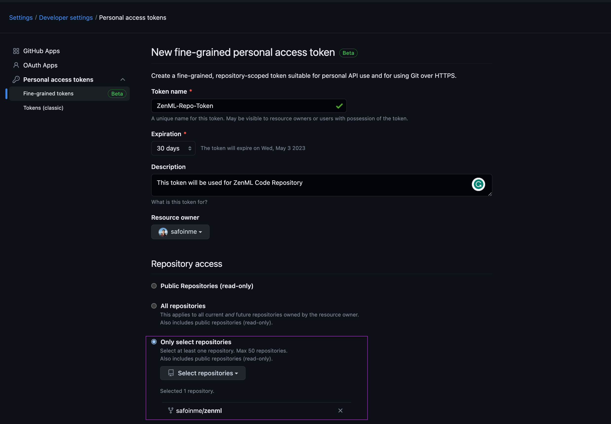
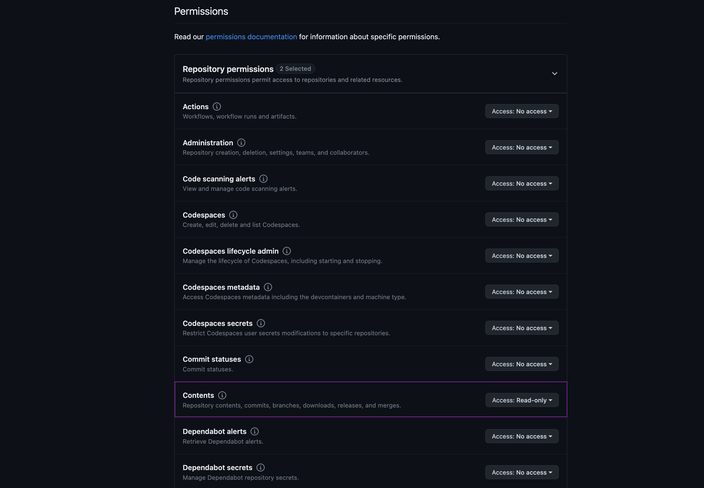
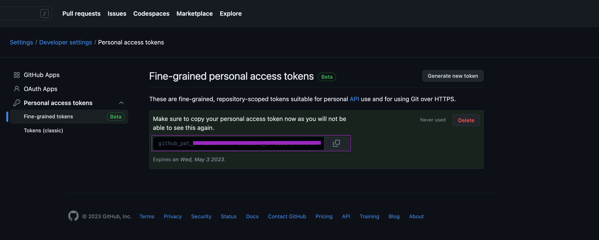
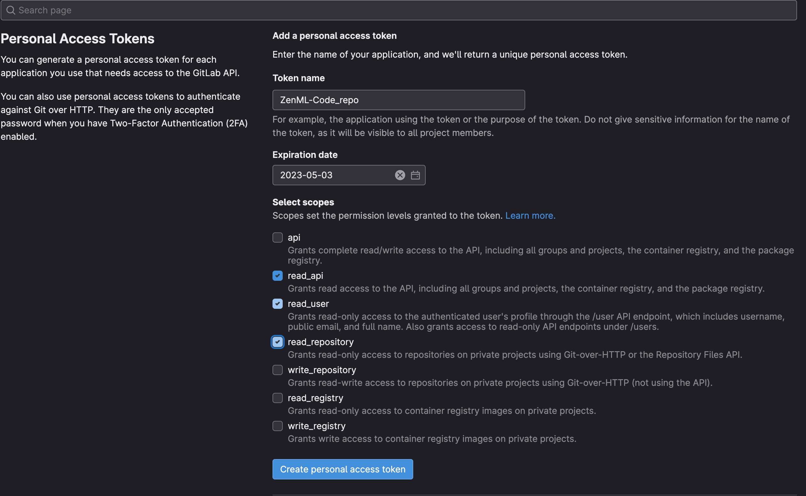

# Connect your git repository

A code repository in ZenML refers to a remote storage location for your code. Some commonly known code repository platforms include [GitHub](https://github.com/) and [GitLab](https://gitlab.com/).

Code repositories enable ZenML to keep track of the code version that you use for your pipeline runs. Additionally, running a pipeline that is tracked in a registered code repository can [speed up the Docker image building for containerized stack components](containerize-your-pipeline.md#reuse-docker-image-builds-from-previous-runs).

Check out the diagram below for a visual representation of how the code repository fits into the general ZenML architecture.

<figure><figcaption></figcaption></figure>


Check out our [code repository example](https://github.com/zenml-io/zenml/tree/main/examples/code\_repository) for a practical tutorial on how to use a ZenML code repository.


## Speeding up Docker builds for containerized components

As [discussed before](containerize-your-pipeline.md#reuse-docker-image-builds-from-previous-runs), when using containerized components in your stack, ZenML needs to [build Docker images to remotely execute your code](manage-environments.md#execution-environments). If you're not using a code repository, this code will be included in the Docker images that ZenML builds. This, however, means that new Docker images will be built and pushed whenever you make changes to any of your source files. When running a pipeline that is part of a [local code repository checkout](connect-your-git-repository.md#detecting-local-code-repository-checkouts), ZenML can instead build the Docker images without including any of your source files, and download the files inside the container before running your code. This greatly speeds up the building process and also allows you to reuse images that one of your colleagues might have built for the same stack.

Some additional points:

* The file download is only possible if the local checkout is clean (i.e. it does not contain any untracked or uncommitted files) and the latest commit has been pushed to the remote repository. This is necessary as otherwise, the file download inside the Docker container will fail.
* If you want to disable or enforce the downloading of files, check out [this docs page](containerize-your-pipeline.md) for the available options.

## Registering a code repository

Code repositories can be registered using the CLI:

```shell
zenml code-repository register <NAME> --type=<TYPE> [--CODE_REPOSITORY_OPTIONS]
```

For concrete options, check out the section on the [`GitHubCodeRepository`](connect-your-git-repository.md#github), the [`GitLabCodeRepository`](connect-your-git-repository.md#gitlab) or how to develop and register a [custom code repository implementation](connect-your-git-repository.md#developing-a-custom-code-repository).

### Detecting local code repository checkouts

Once you have registered one or more code repositories, ZenML will check whether the files you use when running a pipeline are tracked inside one of those code repositories. This happens as follows:

* First, the [source root](advanced-guide.md) is computed
* Next, ZenML checks whether this source root directory is included in a local checkout of one of the registered code repositories

### Tracking code version for pipeline runs

If a [local code repository checkout](connect-your-git-repository.md#detecting-local-code-repository-checkouts) is detected when running a pipeline, ZenML will store a reference to the current commit for the pipeline run so you'll be able to know exactly which code was used. Note that this reference is only tracked if your local checkout is clean (i.e. it does not contain any untracked or uncommitted files). This is to ensure that your pipeline is actually running with the exact code stored at the specific code repository commit.

## Available code repository implementations

ZenML comes with builtin implementations of the code repository abstraction for the `GitHub` and `GitLab` platforms, but it's also possible to use a [custom code repository implementation](connect-your-git-repository.md#developing-a-custom-code-repository).

### GitHub

ZenML provides built-in support for using GitHub as a code repository for your ZenML pipelines. You can register a GitHub code repository by providing the URL of the GitHub instance, the owner of the repository, the name of the repository, and a GitHub Personal Access Token (PAT) with access to the repository.

```shell
zenml code-repository register <NAME> --type=github \
--url=<GITHUB_URL> --owner=<OWNER> --repository=<REPOSITORY> \
--token=<GITHUB_TOKEN>
```

where is the name of the code repository you are registering, is the owner of the repository, is the name of the repository, \<GITHUB\_TOKEN> is your GitHub Personal Access Token and \<GITHUB\_URL> is the URL of the GitHub instance which defaults to `https://github.com.` You will need to set a URL if you are using GitHub Enterprise.

After registering the GitHub code repository, ZenML will automatically detect if your source files are being tracked by GitHub and store the commit hash for each pipeline run.

<details>

<summary>How to get a token for GitHub</summary>

1. Go to your GitHub account settings and click on [Developer settings](https://github.com/settings/tokens?type=beta).
2. Select "Personal access tokens" and click on "Generate new token".
3.  Give your token a name and a description.

    
4.  We recommend selecting the specific repository and then giving `contents` read-only access.

    

    
5.  Click on "Generate token" and copy the token to a safe place.

    

</details>

### GitLab

ZenML also provides built-in support for using GitLab as a code repository for your ZenML pipelines. You can register a GitLab code repository by providing the URL of the GitLab project, the group of the project, the name of the project, and a GitLab Personal Access Token (PAT) with access to the project.

To register a GitLab code repository, run the following CLI command:

```shell
zenml code-repository register <NAME> --type=gitlab \
--url=<GITLAB_URL> --group=<GROUP> --project=<PROJECT> \
--token=<GITLAB_TOKEN>
```

where is the name of the code repository you are registering, is the group of the project, is the name of the project, \<GITLAB\_TOKEN> is your GitLab Personal Access Token, and \<GITLAB\_URL> is the URL of the GitLab instance which defaults to `https://gitlab.com.` You will need to set a URL if you have a self-hosted GitLab instance.

After registering the GitLab code repository, ZenML will automatically detect if your source files are being tracked by GitLab and store the commit hash for each pipeline run.

<details>

<summary>How To get a token for GitLab</summary>

1. Go to your GitLab account settings and click on [Access Tokens](https://gitlab.com/-/profile/personal\_access\_tokens).
2.  Name the token and select the scopes that you need (e.g. `read_repository`, `read_user`, `read_api`)

    
3.  Click on "Create personal access token" and copy the token to a safe place.

    

</details>

### Developing a custom code repository

If you're using some other platform to store your code and you still want to use a code repository in ZenML, you can implement and register a custom code repository.

First, you'll need to subclass and implement the abstract methods of the `zenml.code_repositories.BaseCodeRepository` class:

```python
class BaseCodeRepository(ABC):
    """Base class for code repositories."""

    @abstractmethod
    def login(self) -> None:
        """Logs into the code repository."""

    @abstractmethod
    def download_files(
            self, commit: str, directory: str, repo_sub_directory: Optional[str]
    ) -> None:
        """Downloads files from the code repository to a local directory.

        Args:
            commit: The commit hash to download files from.
            directory: The directory to download files to.
            repo_sub_directory: The subdirectory in the repository to
                download files from.
        """

    @abstractmethod
    def get_local_context(
            self, path: str
    ) -> Optional["LocalRepositoryContext"]:
        """Gets a local repository context from a path.

        Args:
            path: The path to the local repository.

        Returns:
            The local repository context object.
        """
```

After you're finished implementing this, you can register it as follows:

```shell
# The `CODE_REPOSITORY_OPTIONS` are key-value pairs that your implementation will receive
# as configuration in its __init__ method. This will usually include stuff like the username
# and other credentials necessary to authenticate with the code repository platform.
zenml code-repository register <NAME> --type=custom --source=my_module.MyRepositoryClass \
    [--CODE_REPOSITORY_OPTIONS]
```
