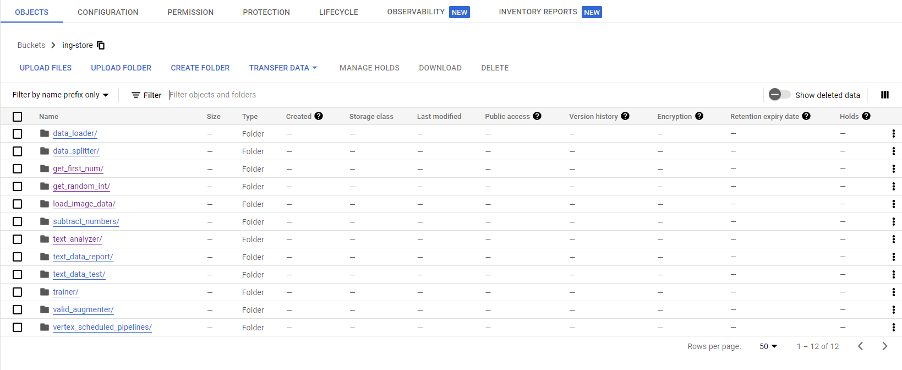

# Data versioning and artifacts management

ZenML seamlessly integrates data versioning and lineage into its core functionality. When a pipeline is executed, each
run generates automatically tracked and managed artifacts. One can easily view the entire lineage of how artifacts are
created and interact with them through the 
[post-execution workflow](/docs/book/user-guide/starter-guide/fetch-runs-after-execution.md).
The dashboard is also a way to interact with the artifacts produced by different pipeline runs. ZenML's artifact
management, caching, lineage tracking, and visualization capabilities can help gain valuable insights, streamline the
experimentation process, and ensure the reproducibility and reliability of machine learning workflows.

## Artifact Versioning, Caching, and Lineage

Each time a ZenML pipeline runs, the system first checks if there have been any changes in the inputs, outputs,
parameters, or configuration of the pipeline steps. Each step in a run gets a new directory in the artifact store:



Suppose a step is new or has been modified. In that case, ZenML creates a new directory structure in
the [Artifact Store](/docs/book/user-guide/component-guide/artifact-stores/artifact-stores.md) with a unique ID and 
stores the data using the appropriate materializers in this directory.


On the other hand, if the step remains unchanged, ZenML intelligently decides whether to cache the step or not. By
caching steps that have not been modified, ZenML can save 
[valuable time and computational resources](/docs/book/user-guide/starter-guide/cache-previous-executions.md),
allowing you to focus on experimenting with different configurations and improving your machine learning models without
the need to rerun unchanged parts of your pipeline.

With ZenML's [post-execution workflow](../starter-guide/fetch-runs-after-execution.md), you can easily trace an artifact
back to its origins and understand the exact sequence of executions that led to its creation, such as a trained model.
This feature enables you to gain insights into the entire lineage of your artifacts, providing a clear understanding of
how your data has been processed and transformed throughout your machine learning pipelines. By leveraging the
post-execution workflow, you can ensure the reproducibility of your results, and identify potential issues or
bottlenecks in your pipelines. This level of transparency and traceability is essential for maintaining the reliability
and trustworthiness of machine learning projects, especially when working in a team or across different environments.

```python
from zenml.post_execution import get_pipelines

# Get all pipelines
pipelines = get_pipelines()

# Get the latest pipeline
pipeline_x = pipelines[0]

# Get the latest version of that pipeline
latest_version = pipeline_x.versions[0]

# Get the last run of that version
last_run = latest_version.runs[0]

# Get your desired step
step = last_run.get_step(step="first_step")

# Get the output of the step
output = step.outputs["output_name"]

# Read the value into memory via its materializer
output.read()  
```

Of course, the dashboard provides a convenient way to look at this information in the DAG visualizer view.

By tracking the lineage of artifacts across environments and stacks, ZenML enables ML engineers to reproduce results and
understand the exact steps taken to create a model. This is crucial for ensuring the reliability and reproducibility of
machine learning models, especially when working in a team or across different environments.

## Artifact Management with Materializers

Materializers play a crucial role in ZenML's artifact management system. They are responsible for handling the
serialization and deserialization of artifacts, ensuring that data is consistently stored and retrieved from
the [artifact store](/docs/book/user-guide/component-guide/artifact-stores/artifact-stores.md). Each materializer
stores data flowing through a pipeline in one or more files within a unique directory in the artifact store:


Materializers are designed to be extensible and customizable, allowing you to define your own serialization and
deserialization logic for specific data types or storage systems. By default, ZenML provides built-in materializers for
common data types and uses `cloudpickle` to pickle objects where there is no default materializer. If you want direct
control over how objects are serialized, you can easily create custom materializers by extending the `BaseMaterializer`
class and implementing the required methods for your specific use case. Read more about
materializers [here](handle-custom-data-types.md).

When a pipeline runs, ZenML uses the appropriate materializers to save and load artifacts using the ZenML `fileio`
system (built to work across multiple artifact stores). This not only simplifies the process of working with different
data formats and storage systems but also enables artifact caching and lineage tracking. You can see an example of a
default materializer (the `numpy` materializer) in
action [here](https://github.com/zenml-io/zenml/blob/main/src/zenml/materializers/numpy\_materializer.py).

## Visualizing Artifacts


Materializers can also generate visualizations for your data. By overriding the `save_visualizations()` method in your
custom materializer, you can create tailored visualizations for specific artifact types. These visualizations can be
viewed in the ZenML dashboard or interactively explored in Jupyter notebooks using the `visualize()` method of an
artifact.

ZenML automatically saves visualizations for many common data types, allowing you to view them in the ZenML dashboard.
This provides an intuitive way to explore and understand the artifacts generated by your ML pipelines, making it easier
to identify patterns, trends, and potential issues in your data and models.

By leveraging ZenML's artifact management, caching, lineage tracking, and visualization capabilities, you can gain
valuable insights into your models, streamline your experimentation process, and ensure the reproducibility and
reliability of your machine learning workflows.