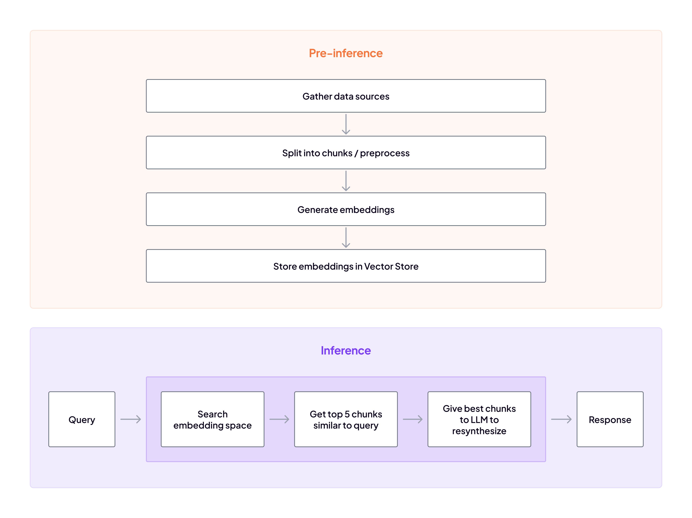
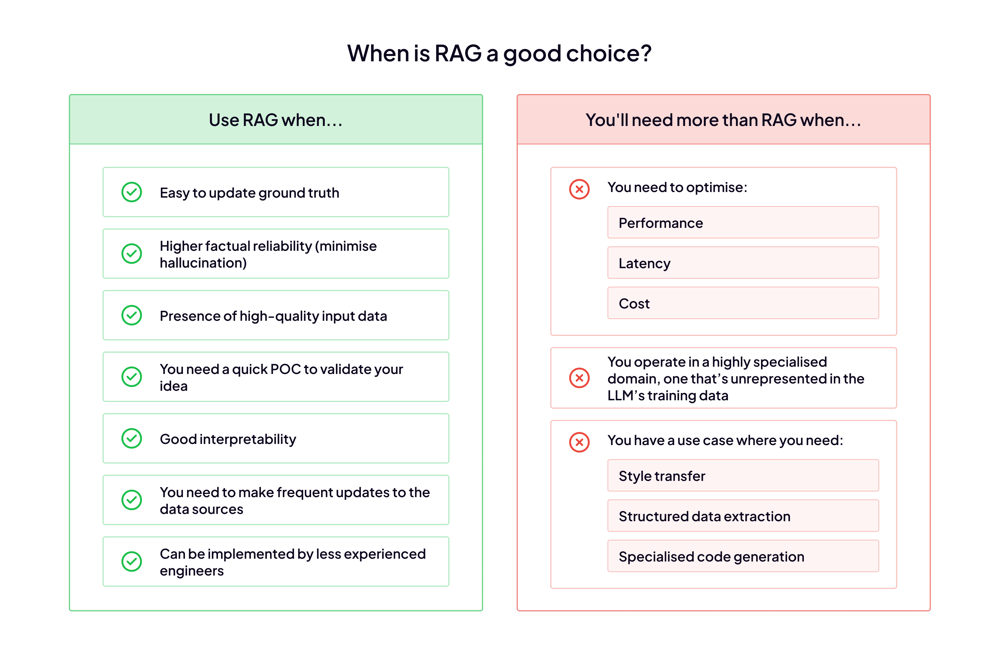


This is an older version of the ZenML documentation. To read and view the latest version please [visit this up-to-date URL](https://docs.zenml.io).


# Understanding Retrieval-Augmented Generation (RAG)

LLMs are powerful but not without their limitations. They are prone to generating incorrect responses, especially when it's unclear what the input prompt is asking for. They are also limited in the amount of text they can understand and generate. While some LLMs can handle more than 1 million tokens of input, most open-source models can handle far less. Your use case also might not require all the complexity and cost associated with running a large LLM.

RAG, [originally proposed in 2020](https://arxiv.org/abs/2005.11401v4) by researchers at Facebook, is a technique that supplements the inbuilt abilities of foundation models like LLMs with a retrieval mechanism. This mechanism retrieves relevant documents from a large corpus and uses them to generate a response. This approach combines the strengths of retrieval-based and generation-based models, allowing you to leverage the power of LLMs while addressing their limitations.

## What exactly happens in a RAG pipeline?

In a RAG pipeline, we use a retriever to find relevant documents from a large corpus and then uses a generator to produce a response based on the retrieved documents. This approach is particularly useful for tasks that require contextual understanding and long-form generation, such as question answering, summarization, and dialogue generation.

RAG helps with the context limitations mentioned above by providing a way to retrieve relevant documents that can be used to generate a response. This retrieval step can help ensure that the generated response is grounded in relevant information, reducing the likelihood of generating incorrect or inappropriate responses. It also helps with the token limitations by allowing the generator to focus on a smaller set of relevant documents, rather than having to process an entire large corpus.

Given the costs associated with running LLMs, RAG can also be more cost-effective than using a pure generation-based approach, as it allows you to focus the generator's resources on a smaller set of relevant documents. This can be particularly important when working with large corpora or when deploying models to resource-constrained environments.

## When is RAG a good choice?

RAG is a good choice when you need to generate long-form responses that require contextual understanding and when you have access to a large corpus of relevant documents. It can be particularly useful for tasks like question answering, summarization, and dialogue generation, where the generated response needs to be grounded in relevant information.

It's often the first thing that you'll want to try when dipping your toes into the world of LLMs. This is because it provides a sensible way to get a feel for how the process works, and it doesn't require as much data or computational resources as other approaches. It's also a good choice when you need to balance the benefits of LLMs with the limitations of the current generation of models.

## How does RAG fit into the ZenML ecosystem?

In ZenML, you can set up RAG pipelines that combine the strengths of retrieval-based and generation-based models. This allows you to leverage the power of LLMs while addressing their limitations. ZenML provides tools for data ingestion, index store management, and tracking RAG-associated artifacts, making it easy to set up and manage RAG pipelines.

ZenML also provides a way to scale beyond the limitations of simple RAG pipelines, as we shall see in later sections of this guide. While you might start off with something simple, at a later point you might want to transition to a more complex setup that involves finetuning embeddings, reranking retrieved documents, or even finetuning the LLM itself. ZenML provides tools for all of these scenarios, making it easy to scale your RAG pipelines as needed.

ZenML allows you to track all the artifacts associated with your RAG pipeline, from hyperparameters and model weights to metadata and performance metrics, as well as all the RAG or LLM-specific artifacts like chains, agents, tokenizers and vector stores. These can all be tracked in the [Model Control Plane](../../../how-to/use-the-model-control-plane/README.md) and thus visualized in the [ZenML Cloud](https://zenml.io/cloud) dashboard.

By bringing all of the above into a simple ZenML pipeline we achieve a clearly delineated set of steps that can be run and rerun to set up our basic RAG pipeline. This is a great starting point for building out more complex RAG pipelines, and it's a great way to get started with LLMs in a sensible way.

A summary of some of the advantages that ZenML brings to the table here includes:

* **Reproducibility**: You can rerun the pipeline to update the index store with new documents or to change the parameters of the chunking process and so on. Previous versions of the artifacts will be preserved, and you can compare the performance of different versions of the pipeline.
* **Scalability**: You can easily scale the pipeline to handle larger corpora of documents by deploying it on a cloud provider and using a more scalable vector store.
* **Tracking artifacts and associating them with metadata**: You can track the artifacts generated by the pipeline and associate them with metadata that provides additional context and insights into the pipeline. This metadata and these artifacts are then visible in the ZenML dashboard, allowing you to monitor the performance of the pipeline and debug any issues that arise.
* **Maintainability** - Having your pipeline in a clear, modular format makes it easier to maintain and update. You can easily add new steps, change the parameters of existing steps, and experiment with different configurations to see how they affect the performance of the pipeline.
* **Collaboration** - You can share the pipeline with your team and collaborate on it together. You can also use the ZenML dashboard to share insights and findings with your team, making it easier to work together on the pipeline.

In the next section, we'll showcase the components of a basic RAG pipeline. This will give you a taste of how you can leverage the power of LLMs in your MLOps workflows using ZenML. Subsequent sections will cover more advanced topics like reranking retrieved documents, finetuning embeddings, and finetuning the LLM itself.

<figure><figcaption></figcaption></figure>
