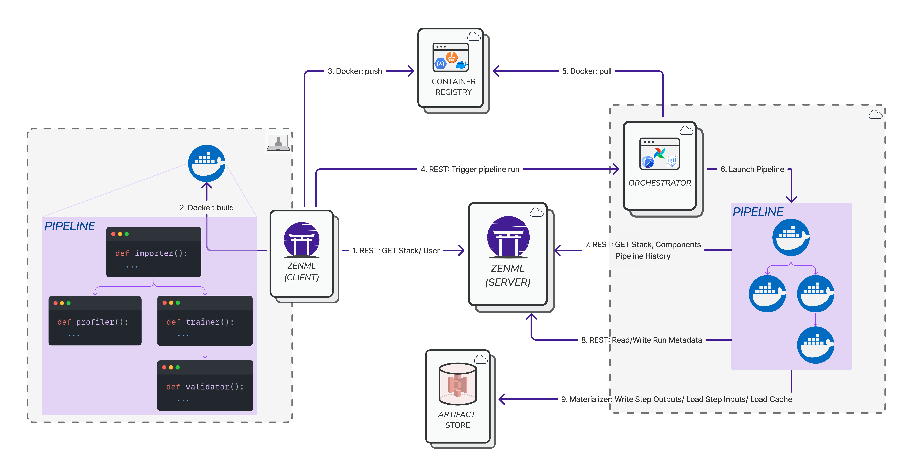

In order to understand the interaction between ZenML clients, a ZenML Server and
other environments, we have compiled a collection of diagrams that highlight 
certain interactions.

## The Basics
The most basic production stack will contain an orchestrator, an artifact store
and a Container registry. The following diagram show how a pipeline is run in 
such a configuration. After fetching the necessary information from the ZenML 
Server (which orchestrator, which container registry), the user code is built 
into a docker image on the client side. It is then pushed to the container
registry. The ZenML client then kicks off the pipeline run on the orchestrator
side. The orchestrator pulls the image containing the user code then assembles
and launches the pipeline. The individual steps communicate with the ZenML 
Server, to fetch information on other components and to read and write metadata
pertaining to the current pipeline run (this includes the location of previous 
step outputs/ cached data).

## The Experiment Tracker
The [experiment tracker](../component-gallery/experiment-trackers/experiment-trackers.md) 
is a very popular component of the stack that helps log and compare the 
metrics of different runs. This diagram shows how the experiment tracker
fits into the overall architecture.

 

## The Model Deployer
At the end of a successful training pipeline, you might want to deploy your
models as prediction endpoints. This can be easily accomplished using
[model deployers](../component-gallery/model-deployers/model-deployers.md).

 

## The Model Registry
The [model registry](../component-gallery/model-registry/model-registry.md)
is a component that helps you keep track of your models. It can be used to
keep track of the different versions of a model, as well as enabling you to
easily deploy your models as prediction endpoints. This diagram shows how
the model registry fits into the overall architecture.

## The Code Repository
The [code repository](../starter-guide/production-fundamentals/code-repositories.md)
refers to a remote storage location that you use to version your code. Registering
your code repository enables ZenML to keep track of the code version that you use for your
pipeline runs. Additionally, running a pipeline which is tracked in a registered code
repository can speed up the Docker image building for containerized stack components.

The diagram shows how downloading code from the code repository allows ZenML to reuse
Docker images for consecutive pipeline runs.

