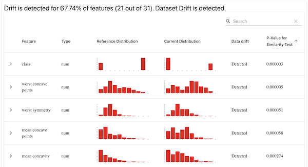

# Explore Drift Detection

Data drift is something you often want to guard against in your pipelines.
Machine learning pipelines are built on top of data inputs, so it is worth
checking for drift if you have a model that was trained on a certain
distribution of data.

This example uses [`evidently`](https://github.com/evidentlyai/evidently), a
useful open-source library to painlessly check for data drift (among other
features). At its core, Evidently's drift detection takes in a reference data
set and compares it against another comparison dataset. These are both input in
the form of a `pandas` dataframe, though CSV inputs are also possible. You can receive these results in the form of a standard dictionary object containing all the relevant information, or as a visualization. We support both outputs.

ZenML implements this functionality in the form of several standardized steps.
You select which of the profile sections you want to use in your step by passing
a string into the `EvidentlyProfileConfig`. Possible options supported by
Evidently are:

- "datadrift"
- "categoricaltargetdrift"
- "numericaltargetdrift"
- "classificationmodelperformance"
- "regressionmodelperformance"
- "probabilisticmodelperformance"

## How the example is implemented

In this example, we compare two separate slices of the same dataset as an easy
way to get an idea for how `evidently` is making the comparison between the two
dataframes. We chose [the University of Wisconsin breast cancer diagnosis
dataset](https://archive.ics.uci.edu/ml/datasets/Breast+Cancer+Wisconsin+(Diagnostic))
to illustrate how it works.

```python
# ... other imports
from zenml.integrations.evidently.steps import (
    EvidentlyProfileConfig,
    EvidentlyProfileStep,
)
from zenml.integrations.evidently.visualizers import EvidentlyVisualizer

# ... data loader and separate steps to get our full and partial dataframes

drift_detector = EvidentlyProfileStep(
    EvidentlyProfileConfig(
        column_mapping=None,
        profile_section="datadrift",
    )
)

@step
def analyze_drift(
    input: dict,
) -> bool:
    """Analyze the Evidently drift report and return a true/false value indicating
    whether data drift was detected."""
    return input["data_drift"]["data"]["metrics"]["dataset_drift"]

@pipeline
def drift_detection_pipeline(
    data_loader,
    full_data,
    partial_data,
    drift_detector,
    drift_analyzer,
):
    """Links all the steps together in a pipeline"""
    data_loader = data_loader()
    full_data = full_data(data_loader)
    partial_data = partial_data(data_loader)
    drift_report, _ = drift_detector(
        reference_dataset=full_data, comparison_dataset=partial_data
    )
    drift_analyzer(drift_report)


def visualize_statistics():
    repo = Repository()
    pipe = repo.get_pipelines()[-1]
    evidently_outputs = pipe.runs[-1].get_step(name="drift_detector")
    EvidentlyVisualizer().visualize(evidently_outputs)


pipeline = drift_detection_pipeline(
        data_loader=data_loader(),
        full_data=full_split(),
        partial_data=partial_split(),
        drift_detector=drift_detector,
        drift_analyzer=analyze_drift(),
)

pipeline.run()

# ... get the relevant artifacts

visualize_statistics()
```

Here you can see that defining the step is extremely simple using our
class-based interface and then you just have to pass in the two dataframes for
the comparison to take place.

We even allow you to use the Evidently visualization tool easily to display data
drift diagrams in your browser or within a Jupyter notebook:



## Run it locally

### Pre-requisites
In order to run this example, you need to install and initialize ZenML:

```shell
# install CLI
pip install zenml

# install ZenML integrations
pip install "evidently<=0.1.40.dev0"
zenml integration install sklearn

# pull example
zenml example pull drift_detection
cd zenml_examples/drift_detection

# initialize
zenml init
```

### Run the project
Now we're ready. Execute:

```shell
python run.py
```

### Clean up
In order to clean up, delete the remaining ZenML references.

```shell
rm -rf zenml_examples
```
