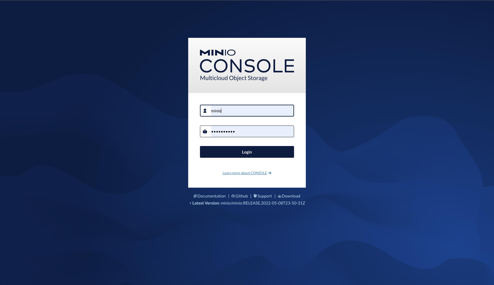
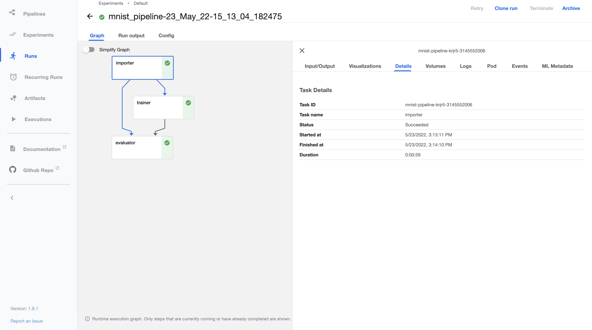

# 🏃 Run pipelines in production using Kubeflow Pipelines

When developing ML models, you probably develop your pipelines on your local
machine initially as this allows for quicker iteration and debugging. However,
at a certain point when you are finished with its design, you might want to 
transition to a more production-ready setting and deploy the pipeline to a more
robust environment.

In this tutorial, we will try to run a continous training, deployment pipeline in kubernetes-grade environment. Using the kubeflow and seldon integration we will go through the steps to setup a s3 compatible storage, setup seldon on the kubernetes cluster and finally run and deploy the pipeline and the model.

You can also watch a video of this example [here](https://www.youtube.com/watch?v=b5TXRYkdL3w).

# 🖥 Setup the environment

This tutorial will go through the steps to setup a kubernetes-grade environment. Link the different components of the environment and then run the pipeline.

If you are looking to run pipelines with the kubeflow without the seldon deployment, you can use the [kubeflow_pipelines_orchestration example]().


## 📄 Prerequisites
In order to run this example, we have to install a few tools that allow ZenML to
spin up a local Kubeflow Pipelines 
setup:

* [K3D](https://k3d.io/v5.2.1/#installation) to spin up a local Kubernetes
cluster
* The Kubernetes command-line tool [Kubectl](https://kubernetes.io/docs/tasks/tools/#kubectl)
to deploy Kubeflow Pipelines
* [Docker](https://docs.docker.com/get-docker/) to build docker images that run
your pipeline in Kubernetes pods (**Note**: the local Kubeflow Pipelines
deployment requires more than 2 GB of RAM, so if you're using Docker Desktop
make sure to update the resource limits in the preferences)
* [Helm Chart](https://helm.sh/docs/) to use seldon core as our deployment integration, we need to install it in our local cluster (**Note**: Helm is an open source package manager for Kubernetes. It provides the ability to provide, share, and use software built for Kubernetes.)

Next, we will install ZenML, get the code for this example and initialize a
ZenML repository:

```bash
# Install python dependencies
pip install zenml
pip install notebook  # if you want to run the example on the notebook

# Install ZenML integrations
zenml integration install kubeflow tensorflow s3 seldon

# Pull the kubeflow example
zenml example pull local_kubeflow_seldon
cd zenml_examples/local_kubeflow_seldon

# Initialize a ZenML repository
zenml init
```

## 💾 Minio Server - S3 compatible artifact storage

The first thing we need to setup is a storage for our pipeline artifacts. We will use the [Minio](https://minio.io/) server as our storage.
The Minio server is a simple S3 compatible server that runs on your local machine.

```bash
# Start the minio server
docker run -p 9000:9000 -p 9001:9001 --name minio \ 
    -d -v ~/minio/data:/data -e "MINIO_ROOT_USER=minio" \
    -e "MINIO_ROOT_PASSWORD=zenmlminio" minio/minio server \
    --console-address :9001 /data

"""
> docker ps
CONTAINER ID   IMAGE         COMMAND                  CREATED         STATUS         PORTS                              NAMES
f34ed5832cfd   minio/minio   "/usr/bin/docker-ent…"   6 seconds ago   Up 6 seconds   0.0.0.0:9000-9001->9000-9001/tcp   minio
"""
```
In order to have one adress for the minio server and make it accessible from the local machine and from the kubernetes cluster, we need to to add the following line to the `etc/hosts` file:
```bash
# Add the minio server to your hosts file etc/hosts
127.0.0.1 host.k3d.internal
```

After that, we want to access the minio server dashboard interface with the following adressess:
`http://host.k3d.internal:9001`. then create a bucket to store the artifacts:




## 🥞 Create a local Kubeflow Pipelines Stack
Now with all the installation and initialization out of the way, all that's left
to do is configuring our ZenML [stack](https://docs.zenml.io/core-concepts). For
this example, the stack we create consists of the following four parts:
* The **minio artifact store** stores step outputs on your hard disk. 
* The **local metadata store** stores metadata like the pipeline name and step
parameters inside a local SQLite database.
* The docker images that are created to run your pipeline are stored in a local
docker **container registry**.
* The **Kubeflow orchestrator** is responsible for running your ZenML pipeline
in Kubeflow Pipelines.
* The **local secrets manager** is responsible for storing and managing secrets in a 
local secret store.
* The **Seldon model deployer** is responsible for deploying models to kubernetes
with Seldon. we will add this to the stack later. After the stack is created we have 
a ready to go Kubeflow Pipelines environment.

```bash
# Register new artifact store
zenml artifact-store register local_minio --flavor=s3 --path=s3://zenml-bucket/ --key="minio" --secret="zenmlminio" --client_kwargs='{"endpoint_url": "http://host.k3d.internal:9000"}'

# Make sure to create the local registry on port 5000 for it to work 
zenml container-registry register local_registry --flavor=default --uri=localhost:5000

# Register the kubeflow orchestrator
zenml orchestrator register kubeflow_orchestrator --flavor=kubeflow

# Register local secrets manager
zenml secrets-manager register local_secrets_manager --flavor=local

# Register the stack
zenml stack register local_kubeflow_seldon_stack \
    -m default \
    -a local_minio \
    -o kubeflow_orchestrator \
    -c local_registry \
    -x local_secrets_manager

# Activate the newly created stack
zenml stack set local_kubeflow_seldon_stack

# Provion the stack and start k3d cluster
zenml stack up
```

## 🏁 Start up Kubeflow Pipelines locally

ZenML takes care of setting up and configuring the local Kubeflow Pipelines
deployment. All we need to do is run:

```bash
zenml stack up
```

When the setup is finished, you should see a local URL which you can access in
your browser and take a look at the Kubeflow Pipelines UI.

### ▶️ Run the pipeline
We can now try run the mnist pipeline by simply executing the python script:

```bash
python run.py
```

This will build a docker image containing all the necessary python packages and
files, push it to the local container registry and schedule a pipeline run in
Kubeflow Pipelines. Once the script is finished, you should be able to see the
pipeline run [here](http://localhost:8080/#/runs).

The Tensorboard logs for the model trained in every pipeline run can be viewed
directly in the Kubeflow Pipelines UI by clicking on the "Visualization" tab
and then clicking on the "Open Tensorboard" button.




## ☁️ Install Seldon Core in local cluster

In order to install Seldon Core in your local cluster, you need to install the istio service mesh. After that, you can install Seldon Core in your local cluster.
For more information about How to setup Seldon Core locally, please visit [Local Seldon Core](https://docs.seldon.io/projects/seldon-core/en/latest/install/kind.html/).

Now that we have istio installed in our local cluster, we need to set Seldon Core to use Istio’s features to manage cluster traffic.

```bash
curl https://raw.githubusercontent.com/SeldonIO/seldon-core/master/notebooks/resources/seldon-gateway.yaml | kubectl apply -f -
```

let's setup install seldon using the following commands:

```bash
kubectl create ns seldon-system

helm install seldon-core seldon-core-operator \
    --repo https://storage.googleapis.com/seldon-charts \
    --set usageMetrics.enabled=true \
    --set istio.enabled=true \
    --namespace seldon-system

# You can check that your Seldon Controller is running by doing:
kubectl get pods -n seldon-system
````

Now that we have seldon installed in our local cluster, the next thing is to extract the URL where the model server exposes its prediction API 

```bash
# Get the Ingress Host Address
kubectl port-forward -n istio-system svc/istio-ingressgateway 8081:80

export INGRESS_HOST=127.0.0.1:8081
```

## 🥞 Register Model Deployer and update stack

To deploy our module on Seldon core, we will register a new model deployer and add it to the current stack.

```bash:
# Get current kubernetes context
kubectl config current-context
    
# Register new model deployer
zenml model-deployer register seldon_local --flavor=seldon \
  --kubernetes_context=k3d-zenml-kubeflow-2a941dd1 --kubernetes_namespace=kubeflow \
  --base_url=http://$INGRESS_HOST \
  --secret=minio-store

```

ZenML will manage the Seldon Core deployments inside the same `kubeflow`
namespace where the Kubeflow pipelines are running. You also have to update the set of
permissions granted by Kubeflow to the Kubernetes service account in the context
of which Kubeflow pipelines are running to allow the ZenML workloads to create,
update and delete secrets. You can do so with the below command:

```bash
kubectl -n kubeflow patch role pipeline-runner --type='json' -p='[{"op": "add", "path": "/rules/0", "value": {"apiGroups": [""], "resources": ["secrets"], "verbs": ["*"]}}]'
```

## 🔎 Manage Seldon Core Credentials

As the last step in setting up the stack, we need to configure a ZenML secret
with the credentials needed by Seldon Core to access the Artifact Store. This is
covered in the [Managing Seldon Core Credentials section](#managing-seldon-core-credentials).

#### Managing Seldon Core Credentials

The Seldon Core model servers need to access the Artifact Store in the ZenML
stack to retrieve the model artifacts. This usually involve passing some
credentials to the Seldon Core model servers required to authenticate with
the Artifact Store. In ZenML, this is done by creating a ZenML secret with the
proper credentials and configuring the Seldon Core Model Deployer stack component
to use it, by passing the `--secret` argument to the CLI command used
to register the model deployer. We've already done the latter, now all that is
left to do is to configure the `s3-store` ZenML secret specified before as a
Seldon Model Deployer configuration attribute with the credentials needed by
Seldon Core to access the artifact store.

There are built-in secret schemas that the Seldon Core integration provides which
can be used to configure credentials for the 3 main types of Artifact Stores
supported by ZenML: S3, GCS and Azure.

For this AWS S3 example, we'll use the standard `seldon_s3` secret schema, but
you can also use `seldon_gs` for GCS and `seldon_az` for Azure. To read more about
secrets, secret schemas and how they are used in ZenML, please refer to the
[ZenML documentation](https://docs.zenml.io/features/secrets).

##### Seldon S3 authentication

you will need to set up credentials explicitly in the ZenML secret,
using the built-in `seldon_s3` secret schema.
e.g.:

```bash
zenml secret register -s seldon_s3 minio-store \
    --rclone_config_s3_env_auth=False \
    --rclone_config_s3_access_key_id='minio' \
    --rclone_config_s3_secret_access_key='zenmlminio' \
    --rclone_config_s3_endpoint='http://host.k3d.internal:9000'
```

### 🏃️Run the code
To run the continuous deployment pipeline:

```shell
python run.py --deploy
```

Example output when run with the local orchestrator stack:

```shell
python run.py --deploy --min-accuracy 0.80
```


That's it! If everything went as planned this pipeline should now be running in the cloud, and we are one step 
closer to a production pipeline!
