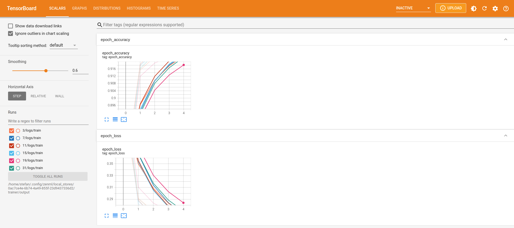
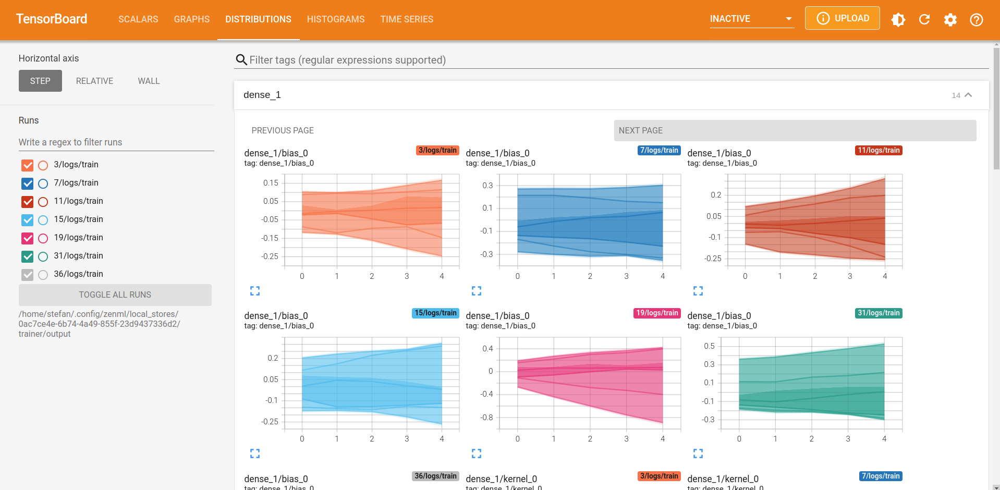
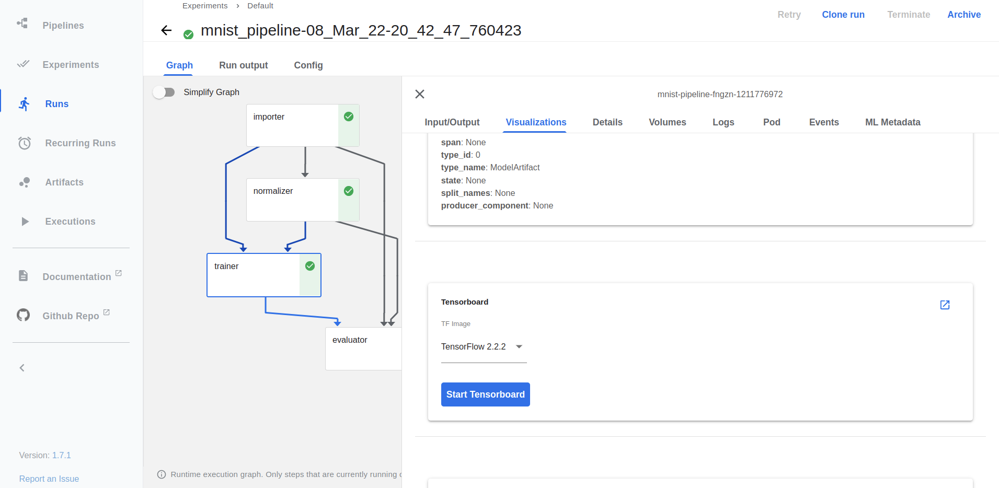
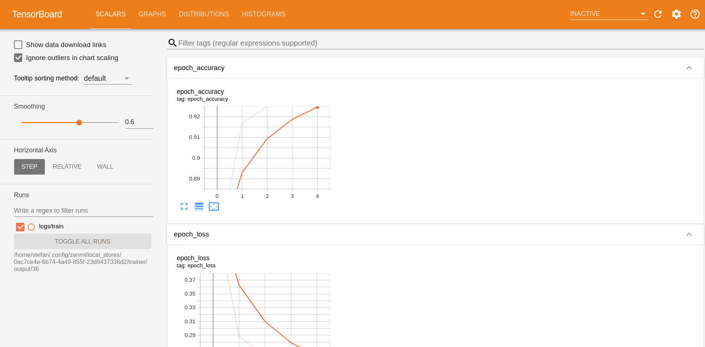

# Deploy pipelines to production using Kubeflow Pipelines

When developing ML models, you probably develop your pipelines on your local
machine initially as this allows for quicker iteration and debugging. However,
at a certain point when you are finished with its design, you might want to 
transition to a more production-ready setting and deploy the pipeline to a more
robust environment.

You can also watch a video of this example [here](https://www.youtube.com/watch?v=b5TXRYkdL3w).

## Pre-requisites

In order to run this example, we have to install a few tools that allow ZenML to
spin up a local Kubeflow Pipelines 
setup:

* [K3D](https://k3d.io/v5.2.1/#installation) to spin up a local Kubernetes
cluster
* The Kubernetes command-line tool [Kubectl](https://kubernetes.io/docs/tasks/tools/#kubectl)
to deploy Kubeflow Pipelines
* [Docker](https://docs.docker.com/get-docker/) to build docker images that run
your pipeline in Kubernetes pods (**Note**: the local Kubeflow Pipelines
deployment requires more than 2 GB of RAM, so if you're using Docker Desktop
make sure to update the resource limits in the preferences)


## Installation

Next, we will install ZenML, get the code for this example and initialize a
ZenML repository:

```bash
# Install python dependencies
pip install zenml
pip install notebook  # if you want to run the example on the notebook

# Install ZenML integrations
zenml integration install kubeflow tensorflow

# Pull the kubeflow example
zenml example pull kubeflow
cd zenml_examples/kubeflow

# Initialize a ZenML repository
zenml init
```

## Use the notebook 
As an alternate to running the below commands, you can also simply use the notebook version and see the story unfold there:

```shell
jupyter notebook
```

Otherwise, please continue reading if you want to run it straight in Python scripts.

## Run on the local machine

### Run the pipeline

We can now run the pipeline by simply executing the python script:

```bash
python run.py
```

The script will run the pipeline locally and will start a Tensorboard
server that can be accessed to visualize the information for the trained model.

Re-running the example with different hyperparameter values will re-train
the model and the Tensorboard server will be updated automatically to include
the new model information, e.g.:

```shell
python run.py --lr=0.02
python run.py --epochs=10
```





### Clean up

Once you're done experimenting, you can stop the Tensorboard server running
in the background by running the command below. However, you may want to keep
it running if you want to continue on to the next step and run the same
pipeline on a local Kubeflow Pipelines deployment.

```bash
python run.py --stop-tensorboard
```

## Run the same pipeline on a local Kubeflow Pipelines deployment

### Create a local Kubeflow Pipelines Stack

Now with all the installation and initialization out of the way, all that's left
to do is configuring our ZenML [stack](https://docs.zenml.io/core-concepts). For
this example, the stack we create consists of the following four parts:
* The **local artifact store** stores step outputs on your hard disk. 
* The **local metadata store** stores metadata like the pipeline name and step
parameters inside a local SQLite database.
* The docker images that are created to run your pipeline are stored in a local
docker **container registry**.
* The **Kubeflow orchestrator** is responsible for running your ZenML pipeline
in Kubeflow Pipelines.

```bash
# Make sure to create the local registry on port 5000 for it to work 
zenml container-registry register local_registry --flavor=default --uri=localhost:5000 
zenml orchestrator register kubeflow_orchestrator --flavor=kubeflow
zenml stack register local_kubeflow_stack \
    -m local_metadata_store \
    -a local_artifact_store \
    -o kubeflow_orchestrator \
    -c local_registry

# Activate the newly created stack
zenml stack set local_kubeflow_stack
```

### Start up Kubeflow Pipelines locally

ZenML takes care of setting up and configuring the local Kubeflow Pipelines
deployment. All we need to do is run:

```bash
zenml stack up
```

When the setup is finished, you should see a local URL which you can access in
your browser and take a look at the Kubeflow Pipelines UI.

### Run the pipeline
We can now run the pipeline by simply executing the python script:

```bash
python run.py
```

This will build a docker image containing all the necessary python packages and
files, push it to the local container registry and schedule a pipeline run in
Kubeflow Pipelines. Once the script is finished, you should be able to see the
pipeline run [here](http://localhost:8080/#/runs).

The Tensorboard logs for the model trained in every pipeline run can be viewed
directly in the Kubeflow Pipelines UI by clicking on the "Visualization" tab
and then clicking on the "Open Tensorboard" button.




At the same time, the script will start a local Tensorboard server that can be
accessed to visualize the information for all past and future versions of the
trained model.

Re-running the example with different hyperparameter values will re-train
the model and the Tensorboard server will be updated automatically to include
the new model information, e.g.:

```shell
python run.py --learning_rate=0.02
python run.py --epochs=10
```

### Clean up
Once you're done experimenting, you can stop the Tensorboard server running
in the background with the command:

```bash
python run.py --stop-tensorboard
```

You can delete the local Kubernetes cluster and all associated resources by
calling:

```bash
zenml stack down
```

## Run the same pipeline on Kubeflow Pipelines deployed to GCP

We will now run the same pipeline in Kubeflow Pipelines deployed to a Google Kubernetes Engine cluster. 
As you can see from the long list of additional pre-requisites, this requires lots of external setup steps at the 
moment. In future releases ZenML will be able to automate most of these steps for you, so make sure to revisit this 
guide if this is something you're interested in!

### Additional pre-requisites

* An existing [GCP container registry](https://cloud.google.com/container-registry/docs).
* An existing [GCP bucket](https://cloud.google.com/storage/docs/creating-buckets).
* [Kubeflow Pipelines](https://www.kubeflow.org/docs/distributions/gke/deploy/overview/) deployed to a Google 
Kubernetes Engine cluster.
* The local docker client has to be [authorized](https://cloud.google.com/container-registry/docs/advanced-authentication) 
to access the GCP container registry.
* Kubectl can [access](https://cloud.google.com/kubernetes-engine/docs/how-to/cluster-access-for-kubectl) your GCP 
Kubernetes cluster.
* The [current context](https://kubernetes.io/docs/reference/kubectl/cheatsheet/#kubectl-context-and-configuration) 
configured in Kubectl points to your GCP cluster. 

### Create a GCP Kubeflow Pipelines stack

To run our pipeline on Kubeflow Pipelines deployed to GCP, we will create a new stack with these components:
* The **artifact store** stores step outputs in a GCP Bucket. 
* The **metadata store** stores metadata inside the Kubeflow Pipelines internal MySQL database.
* The docker images that are created to run your pipeline are stored in GCP **container registry**.
* The **Kubeflow orchestrator** is the same as in the local Kubeflow Pipelines example.

When running the upcoming commands, make sure to replace `$PATH_TO_YOUR_CONTAINER_REGISTRY` and 
`$PATH_TO_YOUR_GCP_BUCKET` with the actual URI's of your container registry and bucket.

```bash
# In order to create the GCP artifact store, we need to install one additional ZenML integration:
zenml integration install gcp

# Create the stack and its components
zenml container-registry register gcp_registry --uri=$PATH_TO_YOUR_CONTAINER_REGISTRY
zenml metadata-store register kubeflow_metadata_store --flavor=kubeflow
zenml artifact-store register gcp_artifact_store --flavor=gcp --path=$PATH_TO_YOUR_GCP_BUCKET
zenml stack register gcp_kubeflow_stack \
    -m kubeflow_metadata_store \
    -a gcp_artifact_store \
    -o kubeflow_orchestrator \
    -c gcp_registry
    
# Activate the newly created stack
zenml stack set gcp_kubeflow_stack
```

### Run the pipeline

Configuring and activating the new stack is all that's necessary to switch from running your pipelines locally 
to running them on GCP:

```bash
python run.py
```

That's it! If everything went as planned this pipeline should now be running in the cloud, and we are one step 
closer to a production pipeline!

## SuperQuick `kubeflow` run

If you're really in a hurry and you want just to see this example pipeline run,
without wanting to fiddle around with all the individual installation and
configuration steps, just run the following:

```shell
zenml example run kubeflow
```
