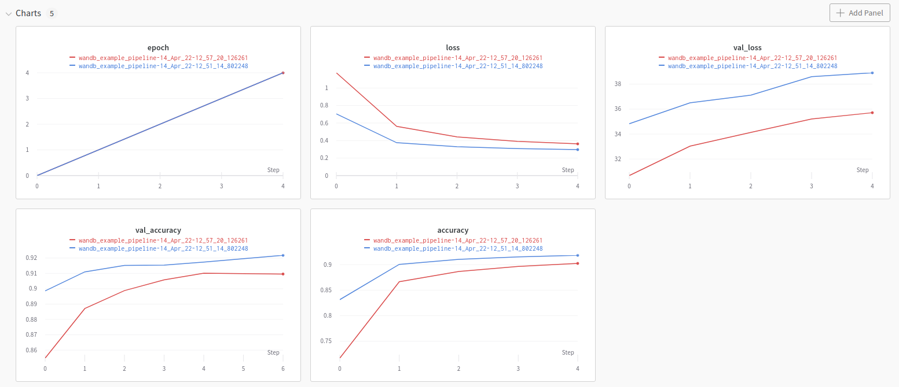

# 🏋️ Integrating Weights & Biases tracking into your pipeline

[Weights&Biases](https://wandb.ai/site/experiment-tracking) is a popular
tool that tracks and visualizes experiment runs with their many parameters,
metrics and output files.

## 🗺 Overview
This example showcases how easily Weights & Biases (`wandb`) tracking can be 
integrated into a ZenML pipeline.

We'll be using the [MNIST](http://yann.lecun.com/exdb/mnist/) dataset and
will train a classifier using [Tensorflow (Keras)](https://www.tensorflow.org/).
We will run two experiments with different parameters (epochs and learning rate)
and log these experiments into a wandb backend. 

In the example script, the [Keras WandbCallback](https://docs.wandb.ai/ref/python/integrations/keras/wandbcallback) is
used within the training step to directly hook into the TensorFlow training.  
It will log out all relevant parameters, metrics and output files. Additionally,
we explicitly log the test accuracy within the evaluation step.

Note that despite `wandb `being used in different steps within a pipeline, 
ZenML handles initializing `wandb` and ensures the experiment name is the 
same as the pipeline name, and the experiment run is the same name as the 
pipeline run name. This establishes a lineage between pipelines in ZenML and 
experiments in `wandb`.

# 🖥 Run it locally

### 📄 Prerequisites 

### Set up a free Weights & Biases account

To get this example running, you need to set up a Weights & Biases account. 
You can do this for free [here](https://wandb.ai/login?signup=true).

### Pre-requisites

In order to run this example, you need to install and initialize ZenML:

```shell
# install CLI
pip install "zenml[server]"

# install ZenML integrations
zenml integration install tensorflow wandb

# pull example
zenml example pull wandb_tracking
cd zenml_examples/wandb_tracking

# initialize
zenml init

# Start the ZenServer to enable dashboard access
zenml up
```

### 🥞 Create the stack with the wandb experiment tracker component

In order to use an experiment tracking tool like Weights & Biases, you need 
to create a new experiment tracker `StackComponent` with the flavor `wandb`, 
and subsequently a new `Stack`. The wandb experiment tracker stack component 
has the following options:

- `api_key`: Non-optional API key token of your wandb account.
- `project_name`: The name of the project where you're sending the new run. 
If the project is not specified, the run is put in an "Uncategorized" project.
- `entity`: An entity is a username or team name where you're sending runs. 
This entity must exist before you can send runs there, so make sure to create 
your account or team in the UI before starting to log runs. If you don't 
specify an entity, the run will be sent to your default entity, which is 
usually your username. 

Note that `project_name` and `entity` are optional in the below command:

```shell
zenml experiment-tracker register wandb_tracker --flavor=wandb \
    --api_key=<WANDB_API_KEY> \
    --entity=<WANDB_ENTITY> \
    --project_name=<WANDB_PROJECT_NAME>

zenml stack register wandb_stack \
    -a default \
    -o default \
    -e wandb_tracker \
    --set
```

### ▶ Run the project

Now we're ready. Execute:

```shell
python run.py
```

### 🔮 See results

The results should be available at the URL: https://wandb.ai/{ENTITY_NAME}/{PROJECT_NAME}/runs/

Every step should yield an additional wandb run in the UI. The naming 
convention of each run is `{pipeline_run_name}_{step_name}` 
(e.g. `wandb_example_pipeline-25_Apr_22-20_06_33_535737_tf_evaluator`)

Each run in wandb will be tagged with two things: `pipeline_name` and 
`pipeline_run_name`, which the user can use to group together and filter. 

For example, here are the runs 'raw' and ungrouped:


Here is the view where we filter for all runs within just the pipeline we ran:


For each run, you should see the following visualizations:




### Using `wandb.Settings`

ZenML allows you to override the [wandb.Settings](https://github.com/wandb/client/blob/master/wandb/sdk/wandb_settings.py#L353) 
class using the `WandbExperimentTrackerSettings` like this:

```python
import wandb
from zenml.integrations.wandb.flavors.wandb_experiment_tracker_flavor import WandbExperimentTrackerSettings

@step(
    experiment_tracker="<EXPERIMENT_TRACKER_NAME>",
    settings={
        "experiment_tracker.wandb": WandbExperimentTrackerSettings(
            settings=wandb.Settings(magic=True)
        )
    }
)
def my_step(
        x_test: np.ndarray,
        y_test: np.ndarray,
        model: tf.keras.Model,
) -> float:
    """Everything in this step is autologged"""
    ...
```

If you want to enable Wandb tracking when using the class-based API, 
simply configure your step as follows:

```python
class MyStep(BaseStep):
    def entrypoint(
        self,
        x_test: np.ndarray,
        y_test: np.ndarray,
        model: tf.keras.Model,
    ) -> float:
        ...

step_instance = MyStep()
step_instance.configure(experiment_tracker="<NAME_OF_EXPERIMENT_TRACKER>")
```

Doing the above auto-magically logs all the data, metrics, and results 
within the step, no further action required!

### 🧽 Clean up
In order to clean up, delete the remaining ZenML references:

```shell
rm -rf zenml_examples
```

# 📜 Learn more

Our docs regarding the Weights & Biases integration can be found 
[here](https://docs.zenml.io/stacks-and-components/component-guide/experiment-trackers/wandb).

If you want to learn more about experiment trackers in general or about how to 
build your own experiment trackers in ZenML check out our 
[docs](https://docs.zenml.io/stacks-and-components/component-guide/experiment-trackers/custom).
